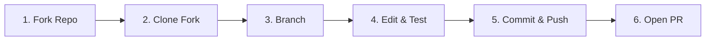

# 🤝 Contributing to H4G CTF Vault

Welcome! Thank you for considering contributing to the H4G CTF Vault & Cheatsheet repository. Whether you're adding new tool cheatsheets, fixing typos, or documenting CTF challenge walkthroughs, your contributions are super welcome!

This repository follows the standard **GitHub Forking Workflow**. Here is a simple step-by-step guide on how to contribute using a fork.

---

## 🚀 Quick Step-by-Step Contribution Guide



---

### Step 1: Fork the Repository

1. Go to the main repository page on GitHub: `https://github.com/zernanvash/cheatsheet`.
2. Click the **Fork** button in the top-right corner of the page.
3. Select your GitHub account to create your personal copy of the repository (`https://github.com/YOUR-USERNAME/cheatsheet`).

---

### Step 2: Clone Your Fork Locally

Open your terminal or command prompt and clone **your forked repository** to your local machine:

```bash
git clone https://github.com/YOUR-USERNAME/cheatsheet.git
cd cheatsheet
```

Next, add the original repository as an `upstream` remote so you can sync changes easily later:

```bash
git remote add upstream https://github.com/zernanvash/cheatsheet.git
```

---

### Step 3: Create a Feature Branch

Always create a new branch for your edits. Keeping your `main` branch clean makes updating your fork much simpler!

```bash
# Fetch latest updates from upstream main
git fetch upstream
git checkout main
git merge upstream/main

# Create and switch to your feature branch
git checkout -b feature/my-new-cheatsheet
```

---

### Step 4: Make Your Edits

Make your changes using your favorite code editor (VS Code, Obsidian, Vim, etc.).

#### 💡 Editing Guidelines:
* **Cheatsheets**: Save new tool cheatsheets in `tools/` and link them in `tools/Tools Index.md`.
* **Playbooks & Blueprints**: Place new guides in `guides/` or `blueprints/`.
* **Code Formatting**: Use standard GitHub-Flavored Markdown. Wrap all commands in code blocks specifying the language (`bash`, `python`, `powershell`).
* **Environment Variables**: Use variables like `$TARGET` (IP), `$URL` (web endpoint), `$LHOST` (attacker IP), and `$LPORT` instead of hardcoded IPs.

If you added or updated markdown writeups, run the enrichment script to verify index building:

```bash
python tools/enrich_writeups.py
```

---

### Step 5: Commit & Push Your Changes

Stage your files, write a concise commit message, and push the branch to **your GitHub fork**:

```bash
# Check changed files
git status

# Stage your modified files
git add .

# Commit with a clear, imperative message
git commit -m "Add new cheatsheet for Go binary analysis"

# Push to your fork on GitHub
git push origin feature/my-new-cheatsheet
```

---

### Step 6: Create a Pull Request (PR)

1. Navigate to your fork on GitHub (`https://github.com/YOUR-USERNAME/cheatsheet`).
2. You should see a banner asking to **Compare & pull request** for your recently pushed branch. Click it!
3. Review your changes in the diff view.
4. Add a brief title and description explaining what your PR adds or fixes.
5. Click **Create Pull Request**.

---

## 🔄 Keeping Your Fork Up to Date

Before starting a new feature in the future, sync your local copy with the main repository:

```bash
git checkout main
git pull upstream main
git push origin main
```

Thank you for helping make this CTF vault better for everyone! 🎉
