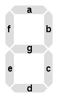

# 7-Segment Display

> Source: [https://www.dcode.fr/7-segment-display](https://www.dcode.fr/7-segment-display)
> Retrieved: 2026-08-08
> Attribution: dCode.fr (CC BY notice on the source page).
> Reference-only extract: no converter, solver, API, or implementation code.

## What is a 7-segment display? (Definition)

A seven-segment display is a popular digit display device, using 7 dashes that can be turned on or off, usually arranged in the form of the numeral 8 . Turning individual segments on or off will display different numbers, letters, and symbols.

## How does a 7 segment display work?

The display consists of seven segments identified by a letter (from a to g ), organized as follows: and each segment is generally associated with an LCD screen or a LED and can thus be activated / on 1 or off 0 . There are a total of 128 possible combinations of display, although it is most often the combinations for the 10 digits (from 0 to 9 ) that are used. bc abdeg abcdg bcfg acdfg acdefg abc abcdefg abcdfg abcdef

bc abdeg abcdg bcfg acdfg acdefg abc abcdefg abcdfg abcdef

## How to encrypt with a 7 segment based cipher?

Segment combinations can represent characters. A combination is generally identified by a series of 1 to 7 letters (from a to g ) corresponding to the activated segments.

It is also possible to identify them with a binary string 1 = active, 0 = inactive, starting from the end gfedcba . In this way a is 0000001 and g is 1000000

Example: has all active segments coded either abcdefg or 1111111

Example: has the 4 bottom segments active, coded either 'c, d, e, g' or 1011100

The 7-segments displays may be common cathode (CC) or common anode (CA), in this second case the 0 and 1 are switched.

## How to decrypt a 7 segment cipher?

Associating an abcdefg code with a display consists of illuminating / activating the corresponding segments.

Example: abcdefg illuminates all segments and displays

Example: bcdeg illuminates segments b,c,d,e,g and displays

## What is a common anode or common cathode display?

In a common cathode display, these are connected to the low potential, a segment is displayed by activating it in its logical 1 position.

In a common anode display, these are connected to the high potential, so a segment is displayed by activating it in its logical 0 position.

## How to recognize a 7 segment ciphertext?

The code consists of the letters a,b,c,d,e,f,g only, in groups of 1 to 7 letters without repetition.

For the binary variant, the codes are normally on 7 bits from 0000000 to 1111111 .

The presence of a calculator, a clock or a digital watch or the characters 7SEG are clues.

## What are the variants of the 7 segment display?

There exist also 9 segment displays (with an additional 2 segment diagonal), 14 segments (with 2 diagonals and a central vertical bar) or 16 segments (identical to the 14 segments but with the top and bottom segments cut in half).

The Beghilos code uses the 7 segments with a reverse reading (backwards).

## When were 7-segment displays invented?

The first patents date from the beginning of the 20th century (1903, 1908, 1910) but the advent of the displays came in the 1970s.

## Reference Images

