# Abyss Language (Genshin Impact)

> Source: [https://www.dcode.fr/abyss-language-genshin-impact](https://www.dcode.fr/abyss-language-genshin-impact)
> Retrieved: 2026-08-08
> Attribution: dCode.fr (CC BY notice on the source page).
> Reference-only extract: no converter, solver, API, or implementation code.

## What is Abyss language? (Definition)

The Abyss language is the name given to the script used by the Order of the Abyss (or Abyssal Order) in the video game Genshin Impact .

## How to write using Abyss script?

The Abyss Language is a writing system using symbols and glyphs replacing the characters of the Latin alphabet (letters from A to Z) but also including 2 punctuation marks the dot . and the comma , .

A B C D E F G H I J K L M N O P Q R S T U V W X Y Z . , dCode.fr

A B C D E F G H I J K L M N O P Q R S T U V W X Y Z . , dCode.fr

Example: GENSHIN is written

dCode uses the Khaenriah font created by AzusaTsang and offered on GitHub here under the Creative Commons Zero License.

## How to translate Abyss language?

Each symbol of the language of the Abyss has a letter/symbol equivalent in English (see table above). The translation is then a transcription symbol for symbol.

Example: is translated ABYSS

It happens that the translated message remains written in Latin. In this case, use a Latin-English translator.

## How to recognize a Abyss ciphertext? (Identification)

The language of the order of the Abyss has quite unique glyphs similar to drawings based on the Latin alphabet (it is possible to distinguish the letters A, B, E, F, I, J, K among others.

Any references to the Genshin Impact video game, and the Order of the Abyss are important clues.

## Reference Images

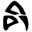
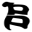
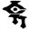
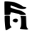
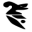
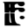
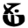
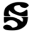
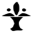
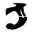
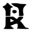
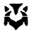
