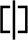
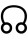
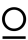
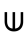

# Alien Language ⏃⌰⟟⟒⋏

> Source: [https://www.dcode.fr/alien-language](https://www.dcode.fr/alien-language)
> Retrieved: 2026-08-08
> Attribution: dCode.fr (CC BY notice on the source page).
> Reference-only extract: no converter, solver, API, or implementation code.

## What is the Alien language? (Definition)

The Alien Language is the name given to an alphabet composed of symbols, and quite widespread on social networks.

## How to encrypt using Alien language cipher?

The Alien language is an alphabet substituting for the 26 letters of the Latin alphabet 26 Unicode symbols selected to resemble the popular culture's imagination symbols of a possible Alien language . A ⏃ B ⏚ C ☊ D ⎅ E ⟒ F ⎎ G ☌ H ⊑ I ⟟ J ⟊ K ☍ L ⌰ M ⋔ N ⋏ O ⍜ P ⌿ Q ⍾ R ⍀ S ⌇ T ⏁ U ⎍ V ⎐ W ⍙ X ⌖ Y ⊬ Z ⋉

A ⏃ B ⏚ C ☊ D ⎅ E ⟒ F ⎎ G ☌ H ⊑ I ⟟ J ⟊ K ☍ L ⌰ M ⋔ N ⋏ O ⍜ P ⌿ Q ⍾ R ⍀ S ⌇ T ⏁ U ⎍ V ⎐ W ⍙ X ⌖ Y ⊬ Z ⋉

Example: DCODE is written

## How to decrypt Alien language cipher?

Deciphering the Alien language requires replacing each Alien symbol with the letter of the Latin alphabet corresponding to it.

Example: ⏃⌰⟟⟒⋏ is translated A,L,I,E,N

## How to recognize an Alien language ciphertext?

The message is composed of symbols resulting in large part from the Unicode block Various technical signs U+2300 to U+23FF in which several symbols of the APL language are found.

All references to extra-terrestrials, aliens, green men, crop circles, etc. are clues.

The selection of these symbols gives the message a singular and codified appearance, which evokes abstract systems of thought or extraterrestrial languages.

## Why is this Alien language not recommended?

This language seems to have been designed in a purely subjective way, without following any linguistic or structural rules. The characters that compose it were apparently chosen from the vast repertoire of the Unicode standard, possibly randomly, without any particular logic.

This did not prevent it from spreading rapidly on the Internet, particularly on the video game Minecraft, where it is associated with the Enderman language (also called Enderwalk ), or on social networks. On the latter, it is often used to transmit cryptic messages or to circumvent automated censorship mechanisms.

Furthermore, this language benefits from an intriguing and catchy name, although deliberately misleading, which contributes to its virality. In reality, there is no particular exclusivity or authenticity to this system: anyone could, with a little imagination, invent another so-called alien or extraterrestrial language using different symbols or combining exotic characters.

## Reference Images

