# Alphabet of Angels and Genii

> Source: [https://www.dcode.fr/alphabet-angels-genii](https://www.dcode.fr/alphabet-angels-genii)
> Retrieved: 2026-08-08
> Attribution: dCode.fr (CC BY notice on the source page).
> Reference-only extract: no converter, solver, API, or implementation code.

## What is the alphabet of angels and genii? (Definition)

In his book Theomagia or The temple of Wisdome from 1664, John Heydon describes an alphabet called Alphabet of the Angels and Genii . On pages 123, 124 and 125 of Book III are presented 24 symbols, each associated with the name of an angel whose initials describe the Latin alphabet (of 24 letters, no J or U ). Here is a scan

## How to encrypt using the angels and genii alphabet?

The writing with the alphabet of the angels is a code by substitution of the letters of the alphabet by a symbol of genius according to the following table: Letter Name of the Genius Symbol A Agiel B Belah C Chemor D Din E Elim F Fabas G Graphiel H Hecadoth I Iah J - = I K Kne L Labed M Mehod N Nebak O Odonel P Paimel Q Quedbaschemod R Relah S Schethalim T Tiriel U - = V V Vabam W Wasboga X Xoblah Y Yshiel Z Zelah

Letter Name of the Genius Symbol A Agiel B Belah C Chemor D Din E Elim F Fabas G Graphiel H Hecadoth I Iah J - = I K Kne L Labed M Mehod N Nebak O Odonel P Paimel Q Quedbaschemod R Relah S Schethalim T Tiriel U - = V V Vabam W Wasboga X Xoblah Y Yshiel Z Zelah

Example: ANGEL is written

## How to decrypt angels and genii alphabet?

The decryption is carried out by substitution of the angelic symbols by the corresponding Latin letter (see above).

Example: is translated GENII

## How to recognize a angels and genii alphabet? (Identification)

The symbols of the alphabet are made up of stars linked together by lines (sometimes crossed out).

The notions of geniuses or genii and angels are clues.

On the internet, there is a visual variant corrected by Donald Tyson that omits the stars and which is partially false, so be careful.

## Reference Images

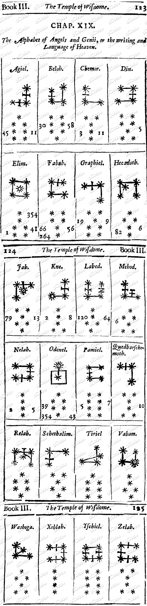
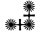
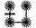
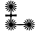
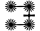
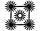
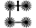
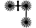
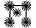
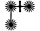

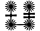
