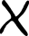
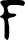
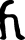
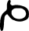
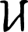
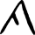
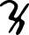

# Alphabetum Kaldeorum

> Source: [https://www.dcode.fr/alphabetum-kaldeorum-rudolf-iv](https://www.dcode.fr/alphabetum-kaldeorum-rudolf-iv)
> Retrieved: 2026-08-08
> Attribution: dCode.fr (CC BY notice on the source page).
> Reference-only extract: no converter, solver, API, or implementation code.

## What is Alphabetum Kaldeorum? (Definition)

The Alphabetum Kaldeorum ( Chaldean alphabet in Latin) is a writing from the Middle Ages, using a substitution encryption system, probably invented by Rudolf IV of Austria.

Two main traces of this alphabet have been preserved: one in a manuscript dating from 1428 kept in Munich and the other on the epitaph of Duke Rudolf IV of Austria, in Vienna.

## How to encrypt using Alphabetum Kaldeorum cipher?

To encode with Alphabetum Kaldeorum , the user must use a specific character set. As writing has varied over time, certain characters have several forms.

Characters used on the cenotaph of Duke Rudolph IV (around 1365):

A B C D E F G H I K L M N O P R S T U W Z dCode.fr

A B C D E F G H I K L M N O P R S T U W Z dCode.fr

Characters copied from the 1428 manuscript:

a b c d e f g h i k l m n o p q r s t u x y z dCode.fr

a b c d e f g h i k l m n o p q r s t u x y z dCode.fr

As the Latin alphabet of the time did not contain J and did not distinguish U from V, these characters are absent.

Example: RUDOLF translates to

## How to decrypt Alphabetum Kaldeorum cipher?

Deciphering with Alphabetum Kaldeorum involves knowledge of the character set/symbols used.

Example: is translated to ALPHABET

## How to recognize a Alphabetum Kaldeorum ciphertext? (Identification)

The identification of the Alphabetum Kaldeorum is done by observing the set of symbols used.

Any references to Duke Rudolf IV of Austria, his wife Catherine of Luxembourg or to Chaldea/Chaldean people are clues.

## What are the variants of the Alphabetum Kaldeorum cipher?

Only variations of writings of the alphabet are known.

## When was Alphabetum Kaldeorum invented?

Duke Rudolf IV of Austria is generally considered a probable author, he lived from 1339 to 1365.

## Reference Images

