# Alternian Alphabet

> Source: [https://www.dcode.fr/alternian-alphabet](https://www.dcode.fr/alternian-alphabet)
> Retrieved: 2026-08-08
> Attribution: dCode.fr (CC BY notice on the source page).
> Reference-only extract: no converter, solver, API, or implementation code.

## What is the Alternian Alphabet? (Definition)

The Alternian Alphabet refers to two sets of glyphs used in the Homestuck universe to represent the Troll language. Although Trolls generally communicate in English, these glyphs replace Latin characters to give a visual identity to their culture.

## What are the two versions of the Alternian alphabet?

The Alternian Alphabet comes in two systems:

— (Old) Daedric Alphabet: Used in Homestuck (2009-2016), this is a 180° inverted version of the Daedric alphabet from The Elder Scrolls.

— (New) Alternian Alphabet : Introduced in Hiveswap (2017-present), this is a set of original glyphs created to avoid copyright issues.

## How to write in Alternian?

To write a text using the Alternian alphabet , select the version: either the old Daedric alphabet (reversed):

A B C D E F G H I J K L M N O P Q R S T U V W X Y Z dCode.fr

A B C D E F G H I J K L M N O P Q R S T U V W X Y Z dCode.fr

either the new Alphabet (introduced with Hiveswap):

a b c d e f g h i j k l m n o p q r s t u v w x y z dCode.fr

a b c d e f g h i j k l m n o p q r s t u v w x y z dCode.fr

Example: HOMESTUCK was translated and now it translates to

## How to translate a text into the Alternian Alphabet?

To translate a text into the Alternian Alphabet , identify the version: check if the text uses the Daedric Alphabet (Homestuck) or the new Alphabet (Hiveswap) and replace the Alternian symbols with the equivalent letters in the Latin alphabet.

Example: translates to TROLL

Example: translates to ALTERNIA

## How to recognize the Alternian alphabet?

The glyphs of the old alphabet are the symbols of the Daedric alphabet inverted by 180° (upside down).

The glyphs of the new alphabet resemble a mixture of runic symbols or extraterrestrial or esoteric glyphs. The strokes are often angular and irregular. The overall impression is of a primitive , or alien, script rather than a modern one.

## Reference Images

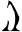
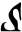
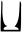
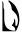
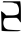
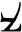
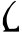
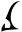
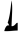
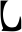
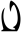
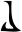
