# American Sign Language

> Source: [https://www.dcode.fr/american-sign-language](https://www.dcode.fr/american-sign-language)
> Retrieved: 2026-08-08
> Attribution: dCode.fr (CC BY notice on the source page).
> Reference-only extract: no converter, solver, API, or implementation code.

## How to encrypt using ALA alphabet from the American Sign Language?

Sign language is visual and has gestures to describe many words, but it is possible to spell a word using the manual alphabet. There is an alphabet for French Sign Language but also an alphabet for American Sign Language .

The letters are signed with one hand with the american manual alphabet AMA as follows: A B C D E F G H I J K L M N O P Q R S T U V W X Y Z dCode.fr

A B C D E F G H I J K L M N O P Q R S T U V W X Y Z dCode.fr

Example: USA can be signed

## How to decrypt American Sign Language?

The decryption of American Sign Language is entirely visual. Many words or names have a single gesture, and only knowledge of this gesture or the provision of a dictionary can translate a word.

However, it is possible that the word is spelled, letter by letter, in this case, the American manual alphabet AMA allows to translate the 26 letters of the alphabet (from A to Z).

Example: translates DCODE

## How to recognize American Sign Language?

The message is made up of hand and finger gestures.

It is very difficult to differentiate between different sign languages (from different countries) without practicing them.

Any mention or quote of people who are deaf, dumb or hard of hearing are clues.

## Reference Images

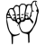
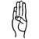
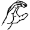
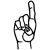
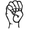
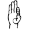
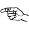

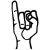
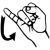
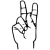
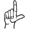
