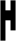
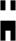
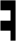
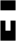
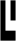
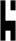
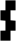
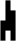
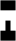

# Ancients Alphabet from Stargate

> Source: [https://www.dcode.fr/ancients-stargate-alphabet](https://www.dcode.fr/ancients-stargate-alphabet)
> Retrieved: 2026-08-08
> Attribution: dCode.fr (CC BY notice on the source page).
> Reference-only extract: no converter, solver, API, or implementation code.

## What is the Ancient language? (Definition)

The language of the ancients (also called lanteans or ancestors from the alteran species) is an imaginary language used in the Stargate universe. It is a mono-alphabetic substitution of the alphabet by old symbols.

## How to encrypt using Ancients language cipher?

The language of the ancients consists of a 23-character alphabet replacing the usual letters of the Latin alphabet. Note that F and U are identical and that the letters Q , X and Z are missing. Words and symbols are rarely spaced, they form blocks. There is no capital or lowercase or punctuation.

Example: STARGATE is written as

The letters Q, X and Z do not appear in the series, also digits, it is the fans who extrapolated the alphabet and proposed additional symbols for these characters.

The alphabet presented here decodes the majority of the text present in season 8 of Stargate SG1 and on StarGate Atlantis.

## How to decrypt the Ancients language cipher?

The language of the ancients uses an alphabet replacing the Latin alphabet. In the series the messages are written in English and each letter is replaced by the corresponding symbol in the ancients' alphabet.

Since the letters F and U are identical, there may be several possible translations.

Example: translates ATLANTIS

## How to recognize a Stargate ancients ciphertext?

The alphabet is composed of pixelated symbols (square or rectangle) forming rectangular patterns with high contrast.

Any reference to the Stargate movie - Stargate or the Stargate SG-1 or Stargate Atlantis series is a clue. The main people in the series: Jack O'Neill, Daniel Jackson, Samantha Carter or Teal'c are also clues.

## Reference Images

