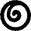
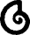
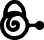
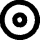
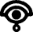
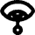
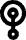
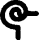

# Arthur and the Invisibles Alphabet

> Source: [https://www.dcode.fr/arthur-invisibles-cipher](https://www.dcode.fr/arthur-invisibles-cipher)
> Retrieved: 2026-08-08
> Attribution: dCode.fr (CC BY notice on the source page).
> Reference-only extract: no converter, solver, API, or implementation code.

## How to encrypt using Minimoys alphabet cipher?

Minimoys alphabet encryption is based on a substitution of letters by a Minimoy symbol. Each of the 26 letters of the English/latin alphabet ABCDEFGHIJKLMNOPQRSTUVWXYZ is associated with a Minimoys alphabet symbol, and the encryption consists of replacing/substituting each letter by its corresponding draw/glyph.

Example: DCODE is written

## How to decrypt Minimoys alphabet cipher?

Minimoys decryption consists in replacing each Minimoys symbol with the corresponding letter in the Latin alphabet.

Example: is decoded as ARTHUR .

## How to recognize a Minimoys ciphertext?

The Minimoys symbols are rather made up of rounded shapes based on circles or spirals, sometimes having small circles similar to eyes, snails or crop circles.

All references to Luc Besson, or to its book/movie Arthur and the Invisibles ( Arthur et les Minimoys en Français) are clues.

## How to learn the alphabet with Minimoys?

The Minimoys alphabet is described with 26 words and names of characters from Arthur's universe to remind the 26 letters of the alphabet: (French version, feel free to submit an English source) Arthur Bétamèche collier Di Vinci épée feuille grand-père horloge image journal Koolomassai lunettes Maltazard noix or Prosciutto quatre roi Selenia tasse uniforme voiture waouh xylophone youpi! zigzag

Arthur Bétamèche collier Di Vinci épée feuille grand-père horloge image journal Koolomassai lunettes Maltazard noix or Prosciutto quatre roi Selenia tasse uniforme voiture waouh xylophone youpi! zigzag

## Reference Images

