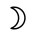
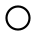
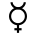
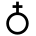
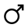
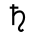
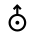

# Astronomical Symbol

> Source: [https://www.dcode.fr/astronomical-symbols](https://www.dcode.fr/astronomical-symbols)
> Retrieved: 2026-08-08
> Attribution: dCode.fr (CC BY notice on the source page).
> Reference-only extract: no converter, solver, API, or implementation code.

## What is an astronomical symbol? (Definition)

An astronomical symbol is a conventional graphic sign historically used to represent a celestial object (Sun, Moon, planet, dwarf planet, or asteroid). These symbols appeared as early as Antiquity and developed primarily during the Renaissance, in the fields of astronomy, astrology, and alchemy.

Each celestial body in the solar system was assigned a name and sometimes a symbol, often inspired by Greco-Roman mythology. Today, modern astronomy favors standardized designations (official names, numbers, IAU codes), but symbols remain in use for historical, educational, or cultural purposes.

## How to recognize astronomical symbols?

Apart from the sun and the moon, the symbols are rather unrepresentative and sometimes there are several symbols (depending on the source) for a same asteroid or planet.

Example: Here are the most common symbols: Sun Moon Mercury Venus Earth Mars Jupiter Saturn Uranus Neptune

Sun Moon Mercury Venus Earth Mars Jupiter Saturn Uranus Neptune

For others, use the form at the top of the page.

Do not confuse astronomical symbols and astrological signs (Zodiac signs).

## What is the list of minor/dwarf planets in the solar system?

Many stars are listed, the best known are: Pluto, Ceres, Pallas, Juno, Vesta, Astraea, Hebe, Iris, Flora, Metis, Hygie, Parthenope, Victoria, Egeria, Irene, Eunomia, Psyche, Thetis, Melpomene, Fortuna, Proserpine, Bellona, Amphitrite, Leucotheae, Fides, etc.

The astronomical symbols for these asteroids are: Amphitrite Astraea Bellona Ceres Egeria Eunomia Fides Flora Fortuna Hebe Hygeia Irene Iris Juno Leukothea Melpomene Metis Pallas Parthenope Pluto Proserpina Psyche Thetis Vesta Victoria

Amphitrite Astraea Bellona Ceres Egeria Eunomia Fides Flora Fortuna Hebe Hygeia Irene Iris Juno Leukothea Melpomene Metis Pallas Parthenope Pluto Proserpina Psyche Thetis Vesta Victoria

## Are there Unicode codes for astronomical symbols?

Unicode codes exist for several astronomical symbols , but coverage is partial and limited: Sun (☉ U+2609), Moon (☽ U+263D), Mercury (☿ U+263F), Venus (♀ U+2640), Earth (⊕ U+2295), Mars (♂ U+2642), Jupiter (♃ U+2643), Saturn (♄ U+2644), Uranus (♅ U+2645), Neptune (♆ U+2646), and Pluto (♇ U+2647).

In contrast, the vast majority of asteroids and dwarf planets do not have official Unicode symbols because their historical glyphs are too numerous, variable, or poorly standardized.

## What numbers are associated with astronomical symbols?

There is no universal numerical value inherent to astronomical symbols in pure astronomy. However, sometimes certain numbers are associated with specific celestial objects.

— Minor Planet Catalog Numbers (Astronomy): When a minor planet is confirmed, the Minor Planet Center assigns it an official number.

Example: 134340 Pluto

— Unicode Values (Computer Science): Each astronomical symbol has a specific numerical value called a Unicode code point (see above).

— Sequential Order (Astronomy and Astrology): Symbols are assigned numbers simply based on their sequential order in our solar system or in the sky: for planets: Mercury is 1, Venus is 2, Earth is 3, etc., according to their distance from the Sun. For zodiac signs: The 12 signs of the zodiac are numbered sequentially starting from the spring equinox. Aries (♈) is 1, Taurus (♉) is 2, Gemini (♊) is 3, and so on down to Pisces (♓), which is 12.

— Numerology and esotericism (excluding astronomy): In traditional numerology, the Sun (☉) is generally 1, the Moon (☽) is 2, but these are mystical associations, not scientific or astronomical ones, and they vary depending on the source.

## Reference Images

