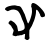
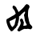
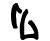
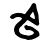
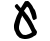

# Atlantean Language

> Source: [https://www.dcode.fr/atlantean-language](https://www.dcode.fr/atlantean-language)
> Retrieved: 2026-08-08
> Attribution: dCode.fr (CC BY notice on the source page).
> Reference-only extract: no converter, solver, API, or implementation code.

## What is the Atlantean language? (Definition)

The Atlantean language is a fictional language created specifically for Disney's film Atlantis: The Lost Empire (2001).

## How to encrypt/write using Atlantean language cipher?

Atlantean is a constructed language (or conlang), meaning it includes a core vocabulary, simplified grammar, and a visually unique writing system.

In practice, the Atlantean alphabet can be considered a pseudo-substitution of the Latin alphabet. Each letter of the alphabet corresponds to an Atlantean symbol.

Example: ATLANTIS is written as

That the language is adapted to an Anglosaxon public, 3 other characters have been introduced for CH , SH and TH (current sounds in English).

Example: CH can be written as

The numbers are also transcribed with points and bars.

Example: 1996 can be written as

An Atlantean multi-line message must be written in boustrophedon , writing every odd line in reverse (from right to left ).

## How to decrypt/translate Atlante language?

The transcription of Atlantean words in the Latin alphabet is done by substituting the Atlantics characters with the corresponding letters / digits.

Example: is translated DISNEY

The Atlantean is read in boustrophedon , a text on several lines must be read from left to right then from right to left , etc., changing at each line.

## What are the names of the digits in atlantean?

Numbers from 1 to 10 are called 1 din 2 dut 3 sey 4 kut 5 sha 6 luk 7 tos 8 ya 9 nit 10 ehep

1 din 2 dut 3 sey 4 kut 5 sha 6 luk 7 tos 8 ya 9 nit 10 ehep

## How to recognize a Atlantean ciphertext?

Atlantean language and symbols are from Proto-Indo-European inspiration. The symbols are rounded and resemble native American or Sumerian characters.

All references to the Disney movie (like Milo James Thatch's character) or to Jules Verne (and his Atlantis) are clues.

Atlantean was invented by Mark Okrand, a linguist known for also creating Klingon in the Star Trek universe.

The clues surrounding the ocean, water, submersion, or Poseidon, are related to the myth of Atlantis.

In 2001, to promote the film, Kellogg's Atlantis cereal was released.

## How to prononce correctly Atlantean words?

The language is anglosaxon consonant, here is the pronunciation (in phonetic alphabet) to use:

A ɑ,ə AH ɑ B b C k D d E ɛ EE i EH e F f G g H x I i,ɪ IH ɪ K k KH x L l M m N n O o,ɔ OA o OH ɔ OO u P p Q k R r,ɾ S s SH ʃ T t U ʊ UH ə V v,w W w X ks Y j Z z

A ɑ,ə AH ɑ B b C k D d E ɛ EE i EH e F f G g H x I i,ɪ IH ɪ K k KH x L l M m N n O o,ɔ OA o OH ɔ OO u P p Q k R r,ɾ S s SH ʃ T t U ʊ UH ə V v,w W w X ks Y j Z z

## How to say Atlantean in Atlantean?

The Atlantean language is named Dig Adlantisag in Atlantean .

## When the Atlantean was invented?

Atlantean was created for the movie Atlantis developed between 1996 and 2001.

## Reference Images

