# Aurebesh Alphabet

> Source: [https://www.dcode.fr/aurebesh-alphabet](https://www.dcode.fr/aurebesh-alphabet)
> Retrieved: 2026-08-08
> Attribution: dCode.fr (CC BY notice on the source page).
> Reference-only extract: no converter, solver, API, or implementation code.

## What is Aurebesh? (Definition)

Aurebesh is a fictional alphabet used in the Star Wars universe to transcribe Galactic Basic Standard (often abbreviated as Basic), the most common language in the galaxy and the equivalent of English in the saga.

This alphabet first officially appeared in Star Wars visuals starting in the 1990s, although it is based on earlier graphic elements present in the early films.

## How to write in Aurebesh?

The Aurebesh alphabet comprises around forty signs and symbols, each with a name and a possible correspondence with the Latin / English alphabet and phonemes: Aurek A Besh B Cresh C Cherek CH Dorn D Esk E Enth Æ Onith EO Forn F Grek G Herf H Isk I Jenth J Krill K Krenth KH Leth L Mern M Nern N Nen NG Osk O Orenth OO Peth P Qek Q Resh R Senth S Shen SH Trill T Thesh TH Usk U Vev V Wesk W Xesh X Yirt Y Zerek Z

Aurek A Besh B Cresh C Cherek CH Dorn D Esk E Enth Æ Onith EO Forn F Grek G Herf H Isk I Jenth J Krill K Krenth KH Leth L Mern M Nern N Nen NG Osk O Orenth OO Peth P Qek Q Resh R Senth S Shen SH Trill T Thesh TH Usk U Vev V Wesk W Xesh X Yirt Y Zerek Z

Example: STAR is written as

The currency symbol is (with small bars similar to currencies like the dollar $ or the Euro € )

## How to decrypt Aurebesh cipher?

Aurebesh works on the principle of character substitution: each symbol corresponds to one or more letters, which are replaced one by one during decipherment/translation.

Example: is translated BASIC

## How to recognize a Aurebesh alphabet?

Aurebesh symbols are not very complex, sometimes angular, sometimes rounded and overall rather wide.

The name Aurebesh is made up of the first 2 letters: Aurek and Besh.

All references to the Star Wars universe or the Galactic Basic language are clues.

## Reference Images

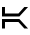
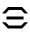
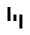
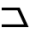
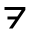

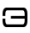
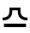
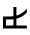
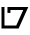
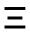
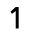
