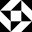
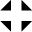

# Betamaze Cipher

> Source: [https://www.dcode.fr/betamaze-cipher](https://www.dcode.fr/betamaze-cipher)
> Retrieved: 2026-08-08
> Attribution: dCode.fr (CC BY notice on the source page).
> Reference-only extract: no converter, solver, API, or implementation code.

## How to encrypt using Betamaze cipher?

Betamaze uses different square tiles for each character, so there are as many tiles as characters (letters / digits) in the message, it is an alphabetic substitution .

Example: ' MAZE ' is coded

Betamaze tiles has no notion of rotation, so each block can be oriented in any direction.

Also the blocks must be glued together to represent as much as possible a labyrinth path (or any drawing).

## How to decrypt Betamaze cipher?

To decipher Betamaze , isolate each square blocks and identify to which they correspond in the Betamaze alphabet.

The orientation of the block does not matter but can be embarrassing to find the right one.

Example: is translated DCODE

## How to recognize a Betamaze ciphertext?

Betamaze looks like a maze , or maybe a QR code with squares and triangles.

Example: BETAMAZE written with itself :

## When Betamaze have been invented ?

The author of Betamaze is Terrana Cliff, art student from California in 2008.

## Reference Images

