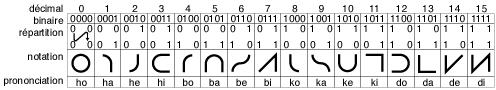

# Bibi-binary Code

> Source: [https://www.dcode.fr/bibi-binary-code](https://www.dcode.fr/bibi-binary-code)
> Retrieved: 2026-08-08
> Attribution: dCode.fr (CC BY notice on the source page).
> Reference-only extract: no converter, solver, API, or implementation code.

## What is Bibi-binary? (Definition)

Bibi-binary is a number representation system invented by Robert Lapointe in 1968.

It is a base-16 ( hexadecimal ) notation in which each digit (from 0 to 15) is replaced by a syllable composed of a consonant and a vowel .

This system allows numbers to be transformed into sequences of pronounceable syllables , with both a playful and mnemonic purpose.

## How to convert to Bibi-binary code?

To convert a decimal number to Bibi-binary , start by converting the number to base $ 16 $ ( hexadecimal ) and replace each hexadecimal digit with its corresponding syllable .

Hexa Bibi Hexa Bibi Hexa Bibi Hexa Bibi 0 HO 4 BO 8 KO c DO 1 HA 5 BA 9 KA d DA 2 HE 6 BE a KE e DE 3 HI 7 BI b KI f DI

Hexa Bibi Hexa Bibi Hexa Bibi Hexa Bibi 0 HO 4 BO 8 KO c DO 1 HA 5 BA 9 KA d DA 2 HE 6 BE a KE e DE 3 HI 7 BI b KI f DI

Example: $ 123_{(10)} $ is written $ 7b_{(16)} $ in hexadecimal , as $ 7 $ corresponds to BI and $ b $ corresponds to KI , then: $ 123 $ is written BIKI in bibibinary.

## How to convert/decrypt the Bibi-binary code?

Each 2-letter bibi-binary group is replaced by its base-16 equivalent.

To convert a bibi-binary word to a decimal number, divide it into 2-letter groups, replace each group with its hexadecimal equivalent, and convert the resulting number from base $ 16 $ to base $ 10 $.

Here is the inverse lookup table:

Bibi Hexa Bibi Hexa HO 0 HA 1 HE 2 HI 3 BO 4 BA 5 BE 6 BI 7 KO 8 KA 9 KE a KI b DO c DA d DE e DI f

Bibi Hexa Bibi Hexa HO 0 HA 1 HE 2 HI 3 BO 4 BA 5 BE 6 BI 7 KO 8 KA 9 KE a KI b DO c DA d DE e DI f

Example: DEKODE is broken down into DE,KO,DE , which is $ e8e_{(16)} $ in base 16 and therefore $ 3726_{(10)} $ in decimal

## How to recognize Bibi-binary code?

The message consists only of two-letter syllables : 'de, da, do, di, be, ba, bo, bi, ke, ka, ko, ki, he, ha, ho, hi'

The message is composed of a maximum of the four consonants 'D, B, K, H' and the four vowels 'E, A, O, I'

## What is Bibi-binary notation?

Bibi-binary also associates each value with a graphic symbol. These symbols are constructed from the 4-bit binary representation:

Bits with a value of $ 1 $ correspond to angles or endpoints, while bits with a value of $ 0 $ correspond to curves.

dCode reuses the font by Jean-Marie Favreau here (OFL license)

## Why the name Bibi-binary?

Boby Lapointe described BiBi-binary as a short binary code . Citations (translated):

With the binary code , with 4 digits, get up to 15. With BiBi-binary , get up to 15 … with 2 letters. […] In argot bibi means me, my name is Boby and my children call me bibi so it is fun to call this system Bibi. […] Binary is a base 2 system , bibinary is a base 4 system , bibi-binary is a base 16 system .

## Base 4 or Base 16 for Bibi-binary?

Bibi-binary is a base-$ 16 $ system. The confusion with a base-$ 4 $ system arises from the fact that each syllable is composed of a consonant (4 possibilities: H, B, K, D) and a vowel (4 possibilities: O, A, E, I). This gives $ 4 × 4 = 16 $ possible combinations , corresponding exactly to the 16 digits of the base-$ 16 $ system.

Some would say it's a base-4 system alternating digits/letters depending on whether the position is even or odd.

## How to convert binary to Bibi-binary?

Segment the binary code in groups of 2 (from the right)

Example: 110111001 becomes '01, 10,11,10,01 '

Always starting from the right, replace the first group with vowels then the next group with consonants and so on alternately according to the table:

00 O H 01 A B 10 E K 11 I D

00 O H 01 A B 10 E K 11 I D

Example: '01, 10,11,10,01 becomes AKIKA', if the number of letters is not even, complete with an initial H or HAKIKA

## When was Bibi-binary code invented?

A patent FR1569028 has been set in 1968 by Robert Lapointe, known as Boby Lapointe.

## Reference Images

