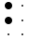
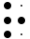
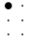
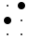
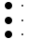
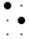
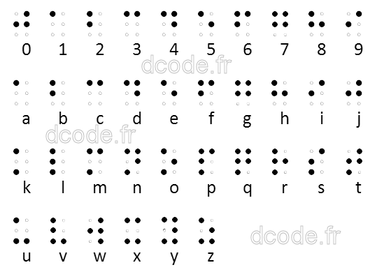
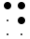
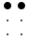
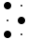

# Braille Alphabet

> Source: [https://www.dcode.fr/braille-alphabet](https://www.dcode.fr/braille-alphabet)
> Retrieved: 2026-08-08
> Attribution: dCode.fr (CC BY notice on the source page).
> Reference-only extract: no converter, solver, API, or implementation code.

## What is Braille? (Definition)

Braille is a tactile writing system that enables blind or visually impaired people to read and write.

It is based on cells of six raised dots, arranged in two columns of three dots. Each combination represents a character (letter, number, punctuation mark, or symbol).

## How to encrypt using Braille cipher?

Braille encoding involves associating each character with a cell composed of six dots, which may be raised to allow for tactile reading by one or more fingers.

These dots are numbered as follows: left column (1, 2, 3) and right column (4, 5, 6).

There are different alphabets, all based on the French alphabet (first created by Louis Braille ). Today, the International alphabet is the most widely used.

A ⠁ B ⠃ C ⠉ D ⠙ E ⠑ F ⠋ G ⠛ H ⠓ I ⠊ J ⠚ K ⠅ L ⠇ M ⠍ N ⠝ O ⠕ P ⠏ Q ⠟ R ⠗ S ⠎ T ⠞ U ⠥ V ⠧ W ⠺ X ⠭ Y ⠽ Z ⠵

A ⠁ B ⠃ C ⠉ D ⠙ E ⠑ F ⠋ G ⠛ H ⠓ I ⠊ J ⠚ K ⠅ L ⠇ M ⠍ N ⠝ O ⠕ P ⠏ Q ⠟ R ⠗ S ⠎ T ⠞ U ⠥ V ⠧ W ⠺ X ⠭ Y ⠽ Z ⠵

Example: BRAILLE is written '⠃ ⠗ ⠁ ⠊ ⠇ ⠇ ⠑' ( Unicode characters) or (images)

The dots are read in column and are numbered 1-2-3 for the first column and 4-5-6 for the second.

Example: BRAILLE can therefore also be written 12,1235,1,24,123,123,15

For the digits, there are 2 modes, the international mode uses the symbol ⠼ (3-4-5-6 - backward L ) and the letters from A to J are respectively 1,2,3,4,5,6,7,8,9 and 0. The second French mode, called Antoine, uses the symbol ⠠ (6) instead of ⠼ but keeps the letters from A to J for the value of the digits.

Example: 1 is thus written ⠼⠁ (international mode) or ⠠⠁ (Antoine mode)

An ambiguity can arise on the interpretation of the numbers with several digits '⠼⠁ ⠁' can mean 11 or 1A , to avoid this the numeric symbol ⠼ can be repeated with each digit.

## How to decrypt Braille cipher?

Braille decoding consists of associating each cell of dots with its corresponding character in the Braille alphabet.

Example: or 145 14 135 145 15 is decrypted DCODE

For digits, pay attention to the potential prefix ⠼ (3456) or ⠠ (6)

## How to recognize Braille ciphertext?

Braille is characterized by patterns of raised dots arranged in cells of 6 positions (2 columns of 3 dots). Each cell is evenly spaced to allow for smooth tactile reading.

However, it can also appear in non-tactile visual forms, such as Unicode characters or numerical notations (see § Variants).

## What are the variants of the Braille cipher?

Braille exists in several forms:

— Linguistic adaptations: some languages have their own conventions (accents, specific letters)

— Numerical representations: each cell can be described by the numbers of the active dots

— Binary representations: each dot is coded by a bit, or a sequence of 6 bits.

There is also an 8-dot braille , used as a supplement in computer science and mathematics; see GS8 braille .

## How to print Braille?

Braille printing can be done with an embosser. More recently, 3D printing, although much longer, allows you to make your own braille prints.

According to the Braille Authority, a Braille dot must have a diameter of 1.44 mm and a height of 0.48 mm.

The distance between 2 points of the same character (horizontally or vertically) must be 2.34 mm. While the center distance between 2 identical points of 2 consecutive characters must be 6.20 mm. here

## When was Braille alphabet invented?

The braille system was introduced in 1829 by Louis Braille . It was inspired by a military night-time communication system, but was simplified and optimized for efficient tactile reading.

## Reference Images

