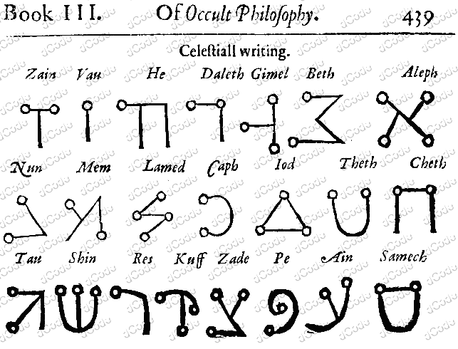

# Celestial Alphabet

> Source: [https://www.dcode.fr/celestial-alphabet](https://www.dcode.fr/celestial-alphabet)
> Retrieved: 2026-08-08
> Attribution: dCode.fr (CC BY notice on the source page).
> Reference-only extract: no converter, solver, API, or implementation code.

## What is the Celestial alphabet? (Definition)

The Celestial Alphabet is an esoteric alphabet described by Henri-Corneille Agrippa of Nettesheim in his work De occulta philosophia (On Occult Philosophy), published in the 16th century.

In Book III, page 439, Agrippa presents this alphabet as a so-called angelic script, composed of symbols believed to possess mystical value. Here is an excerpt from the original manuscript:

## How to encrypt using Celestial alphabet/cipher?

Writing text with the Celestial script involves replacing each Hebrew letter with its corresponding Celestial glyph.

A transliteration is therefore necessary to encrypt a word or a sentence from the Latin alphabet (our usual alphabet).

Example: The letter A is transcribed with the Hebrew letter Aleph ( א ), likewise, the letter B with Beth ( ב ), etc. However, this association is not always possible (there are only 22 Hebrew letters against 26 Latin letters).

Example: CELESTIAL is transcribed גהלהשתיאל or

Reminder: Hebrew, and therefore Celestial script, is read from right to left .

## How to decrypt Celestial alphabet/cipher?

Decoding a text written in Celestial involves replacing each Celestial glyph with the corresponding Hebrew letter, then transliterating the Hebrew into the Latin/English alphabet.

This process is not always straightforward: certain Hebrew characters do not have an equivalent in our Latin alphabet (such as ט or צ ), and there are even letters Hebrew with several possible transliterations (like ג for C or G , י for I or J or even ו for F , V or U ).

Example: becomes אנגהליג or ANGELIC

Reminder: the Hebrew scriptures are read from right to left .

## How to recognize a Celestial ciphertext?

The characters of the Celestial alphabet are distinguished by geometric shapes composed of straight (sometimes curved) lines/sticks ending in solid circles reminiscent of stellar points/stars.

This graphic appearance evokes a constellation map, hence the name Celestial .

References to magic, angels, Kabbalah, or Renaissance esotericism are often clues to its presence.

Note: the Malachim and Passage du Fleuve (or Passing the River ) alphabets are visually very similar and come from the same Kabbalistic tradition.

## When was Celestial invented?

The publication of Heinrich Cornelius Agrippa's book dates from the 16th century.

The exact author of this alphabet is not known. It could be a creation of Agrippa himself or an adaptation of an older source.

## Reference Images

