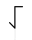

# Chappe Code

> Source: [https://www.dcode.fr/chappe-code](https://www.dcode.fr/chappe-code)
> Retrieved: 2026-08-08
> Attribution: dCode.fr (CC BY notice on the source page).
> Reference-only extract: no converter, solver, API, or implementation code.

## What is Chappe Code? (Definition)

The Chappe code is the name given to the set of possible signals from a Chappe tower/machine, also known as an aerial telegraph (or optical telegraph) and deployed on French territory from the end of the 18th century. This machine is articulated around a central mast at the top of which turns a bar ending at its ends with 2 arms which are also articulated. Positioned on a tower, at high places, to be visible for several kilometers around, the Chappes machines could therefore vary their positions to send messages.

## How to encrypt using Chappe code?

The Chappe code lists 92 possible positions and associates a number with them (between 1 and 92). The receiver and the sender must agree on the meaning of the numbers sent using a vocabulary.

The vocabulary is presented as a directory/dictionary of 92 pages each comprising 92 words (or set of words). So to encode a word, it was necessary to send 2 numbers, the first being the page number, the second the line (or word) number.

Example: The word Homme (Man in French) was coded (43-51) or in for the Chappe vocabulary used in 1809 in Savoy (source: Montvernier report).

Unfortunately, there is no longer any original Chappe vocabulary. All would have been lost, destroyed/burnt or stolen. However, there are still traces of communications, sometimes with coded messages and their transcription, but no complete vocabulary. However, a copy of a special vocabulary (which does not correspond to the transcriptions found, because older) was found here It was digitized by Thérèse Eveilleau here and dCode relies on her work for the above decoder.

## How to decrypt Chappe code?

The Chappe code begins with a translation of the telegraph positions into their corresponding number. Then, these numbers are decoded according to a vocabulary.

Generally, the numbers are grouped by 2, the first being the page number and the second the line number in the vocabulary.

Example: corresponds to the numbers 4-46, i.e. page 4, line 46: General Governor in the Chappe vocabulary used in 1809 in Savoy (source: Montvernier report).

## How to recognize a Chappe code ciphertext?

Chappe code is visual, similar to semaphores.

A message composed of numbers between 1 and 92 can also be a Chappe code .

All references to the genesis of communications, of the telegraph (with the keywords optics or air ) or to Claude Chappe are clues.

## How many positions are there in the Chappe code?

Theoretically, it is possible to create 196 distinct signals (the central bar has 2 positions, and the arms 7 positions). But in practice to avoid errors, only 98 are used, 6 of them being reserved for signal preparation.

## What is the special vocabulary?

A special vocabulary dictionary was in Rennes, France and is exhibited at the Museum of Transmissions (Espace Ferrié) in Cesson-Sévigné in Ille-et-Vilaine (35).

The dictionary has 99 pages of 99 lines, which means that it is not an original Chappe vocabulary: only numbers up to 92 have a representation.

According to Mr. Ollivier, a specialist in Chappe telegraphy, it would be a special vocabulary dating from after 1850 (1854 according to certain sources) used for the transmission by electric telegraph (therefore not aerial) of messages secrets from the authorities. It could nevertheless be a an evolution of the vocabulary of Chappe (but, a priori, the codes do not correspond to the known messages transmitted by Chappe).

dCode offers this vocabulary because it is used (erroneously) by several other sites and treasure hunts, but it is not a Chappe Vocabulary. dCode is also limited to the first 92 words of the first 92 pages.

## What are the variants of the Chappe code?

The Chappe code has known several versions, several vocabularies, several other positions.

An alphabetic variant (allowing to code the letters from A to Z) would also have been used, dCode offers a page dedicated to the Chappe alphabet .

## When was Chappe code invented?

The first version presented by Claude Chappe dates from 1793.

## Reference Images

