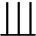
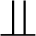
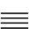
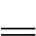
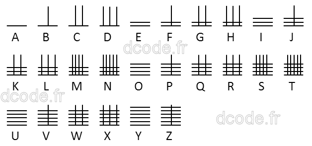
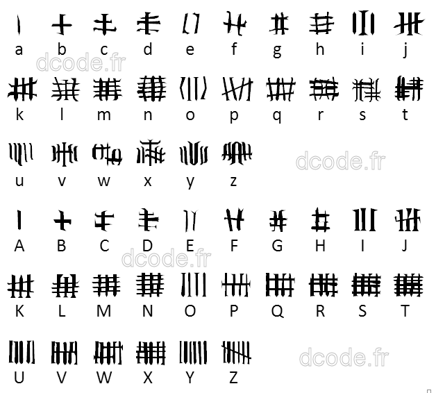

# Chinese Code

> Source: [https://www.dcode.fr/chinese-code](https://www.dcode.fr/chinese-code)
> Retrieved: 2026-08-08
> Attribution: dCode.fr (CC BY notice on the source page).
> Reference-only extract: no converter, solver, API, or implementation code.

## What is the Chinese Code? (Definition)

The Chinese code (or Samurai code ) is a Scout code using intersecting vertical and horizontal lines to code letters according to the position of vowels and consonants in the alphabet.

## How to encrypt using Chinese Code cipher?

Encryption with chinese code uses the positions (ranks) of vowels and consonants in the alphabet.

In the original chinese code cipher, the horizontal bars represent the vowels: A (1 bar), E (2 bars), I (3 bars), O (4 bars), U (5 bars), Y (6 bars) and vertical bars represent the number of consonants that follow the vowel in the alphabet.

Example: To code C , which is the 2nd consonant following the vowel A , use 1 horizontal bar ( A is the first vowel) and 2 vertical bars. To code L , which is the 3rd consonant following the vowel I , use 3 horizontal bars (I is the 3rd vowel) and 3 vertical bars.

Example: DCODE is written

The full original alphabet used is:

There exists a variation which inverts the vertical and horizontal bars (also called the Samurai alphabet)

## How to decrypt Chinese Code cipher?

Count the number of horizontal and vertical lines. The number of horizontal lines represent the vowels: A, E, I, O, U, Y then the number of vertical lines is used for the number of consonants following the vowel.

The Samurai variant swaps the vertical and horizontal lines.

## How to recognize Chinese Code ciphertext?

The ciphered message is made of horizontal and vertical bars/lines/sticks. It is often used by scouts.

References to China, Samurai, Bushis, or Mandarins are clues.

The principle is very similar to unary marks.

## What are the variants of the Chinese Code cipher?

It is possible to switch vertical and horizontal lines in order that the represent consonants and vowels or the opposite.

## Reference Images

