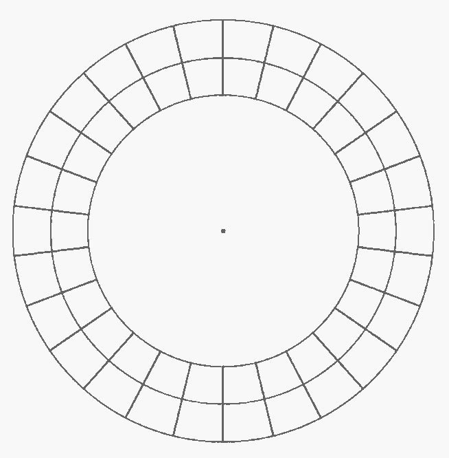
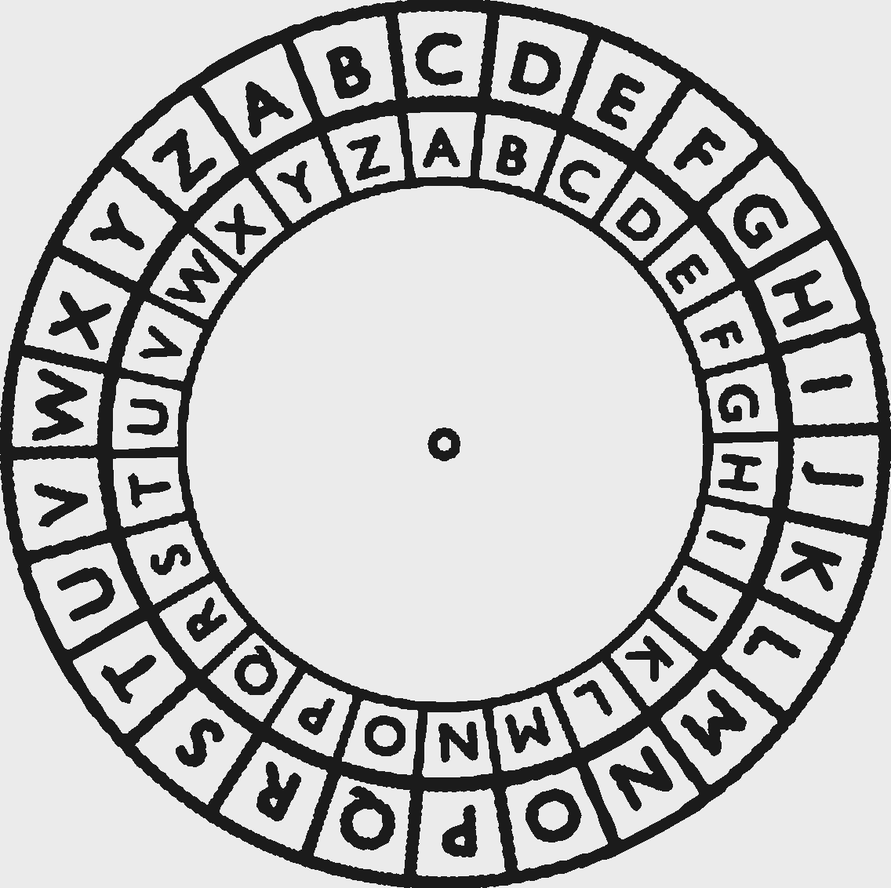

# Cipher Disk/Wheel

> Source: [https://www.dcode.fr/cipher-disk](https://www.dcode.fr/cipher-disk)
> Retrieved: 2026-08-08
> Attribution: dCode.fr (CC BY notice on the source page).
> Reference-only extract: no converter, solver, API, or implementation code.

## What is a disk cipher? (Definition)

A cipher disc is a mechanical tool made up of 2 dials (1 inner disc and 1 outer disc) making it possible to represent a mono-alphabetic substitution by rotating the discs relative to each other. The alignment of the boxes thus obtained indicates the correspondence of the letters. Here is an example of an (empty) disk that can be filled with the 26 letters of the alphabet

Generally, at least 1 of the 2 discs contains the alphabet in its classic order: ABCDEFGHIJKLMNOPQRSTUVWXYZ , the second can be different and contain a disordered alphabet .

Often, the inner disk is used as a reference for the plain letters, and the outer disk is used for the coded letters.

## How to encrypt using a disk cipher?

Select a position for the disc (by rotating the inner or outer dial) and the reference disc for the plain message letters.

For each letter of the message to be encrypted, locate the letter on the plain disc and note the corresponding letter located opposite on the encrypted disc.

Example: The message DISK becomes FKUM with the disk

## How to decrypt a disk cipher?

Position the disc at a defined offset.

For each letter of the coded message, locate the letter on the encrypted disc and note the corresponding letter opposite on the plain disc.

## How to set disk position?

Choosing the position of the disc means indicating which letters correspond to which others. There are several methods:

— Give a 2-letter key, defining a couple (plain letter-encrypted letter), the user must then align the 2 letters before starting an encryption (or decryption). Sometimes the letters are next to each other: AB or separated by a hyphen A-B or by the equal sign A=B .

— Give only one letter, the second letter omitted being the plain letter A .

— Give a number, defining the offset value of the rotating disk (usually exterior) with respect to the fixed disk (usually interior), a positive value indicating the clockwise direction and a negative value indicating the counterclockwise direction.

## How to recognize a disk ciphertext? (Identification)

A disk encryption is nothing more than an alphabetical substitution . Using disk makes it easier to encrypt/decrypt by hand.

The index of coincidence of a disk-encrypted message is therefore similar to that of the plain message.

The frequency analysis should highlight the coding letter for E .

The notions of disc, wheel or dial are clues.

## What are the variants of the disk cipher?

The disk cipher allows to represent any substitution like the Caesar cipher , or the Atbash code.

Alberti proposed the use of cipher disks and improved its security slightly by proposing to periodically shift/rotate the disk according to a defined period and increment, see Alberti 's cipher.

## Reference Images

