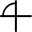
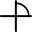
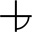
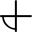
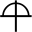
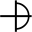
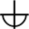
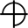
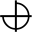
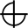

# Circular Glyphs Alphabet

> Source: [https://www.dcode.fr/circular-glyphs-alphabet](https://www.dcode.fr/circular-glyphs-alphabet)
> Retrieved: 2026-08-08
> Attribution: dCode.fr (CC BY notice on the source page).
> Reference-only extract: no converter, solver, API, or implementation code.

## What is Circular Glyphs? (Definition)

Circular Glyphs is a substitution graphic alphabet based on a geometric construction based on circles and arcs of circles on a grid.

## How to encrypt using Circular Glyphs cipher?

Circular Glyphs defines a symbol for each alphanumeric character (as well as an empty character , as a spacing mark) according to this correspondence table of glyphs: A B C D E F G H I J K L M N O P Q R S T U V W X Y Z 0 1 2 3 4 5 6 7 8 9 dCode.fr

A B C D E F G H I J K L M N O P Q R S T U V W X Y Z 0 1 2 3 4 5 6 7 8 9 dCode.fr

Example: CIRCLE is written

Lowercase and uppercase are the same.

## How to decrypt Circular Glyphs cipher?

Unlike encryption, decryption replaces circular symbols with their equivalent (letter or number) in the alphabet.

Example: is translated PI

## How to recognize a Circular Glyphs ciphertext? (Identification)

The designs are all based on circular arcs, cut into 4 quadrants/sectors.

A glyph with 2 arcs of circles are never positioned in 2 opposite quadrants.

When there are several rows, the symbols form a grid.

The drawings were made by Irolan and posted on his Deviant Art page here

## Reference Images

