# Copiale Cipher

> Source: [https://www.dcode.fr/copiale-cipher](https://www.dcode.fr/copiale-cipher)
> Retrieved: 2026-08-08
> Attribution: dCode.fr (CC BY notice on the source page).
> Reference-only extract: no converter, solver, API, or implementation code.

## What is Copiale Cipher? (Definition)

The Copiale code is the name given to a substitution alphabet (homophonic) discovered in a fully encrypted manuscript, whose only inscriptions are Philipp , 1866 and ' Copiales 3'.

The manuscript was decoded by a team of researchers in 2011. The content of the book describes in German language, an initiation ceremony for a secret society.

## How to encrypt using Copiale cipher?

The Copiale code uses a homophonic substitution alphabet (several characters can correspond to the same starting character).

Example: COPIALE can be written or also

Here is the correspondence table found by the researchers:

A Ä B C D E F G H I J K L M N O Ö P R S T U Ü V W X Y Z SCH ST CH EN EM ⌴

A Ä B C D E F G H I J K L M N O Ö P R S T U Ü V W X Y Z SCH ST CH EN EM ⌴

The letter Q has no translation. The space character is systematically encoded.

## How to decrypt Copiale cipher?

The decryption of the Copiale code is an inverse substitution, each character is then translated into a letter of the Latin alphabet or a space (or in rare cases, a group of letters).

There are a few exceptions: first the character seems to be used to repeat the previous letter (often a consonant). Then, several characters have no meaning:

## How to recognize a Copiale ciphertext? (Identification)

The text is composed of characters from the Latin alphabet, a few Greek letters, and a minority of various glyphs.

No spaces are visible in the text (because spaces are encrypted by a letter)

Any references to a secret society, German or in Germany or to a manuscript are clues.

## Reference Images

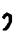
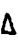
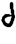
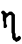
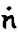

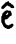
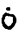
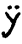
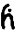
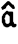
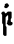
