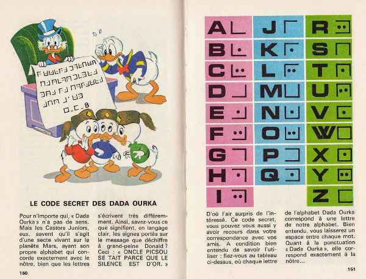
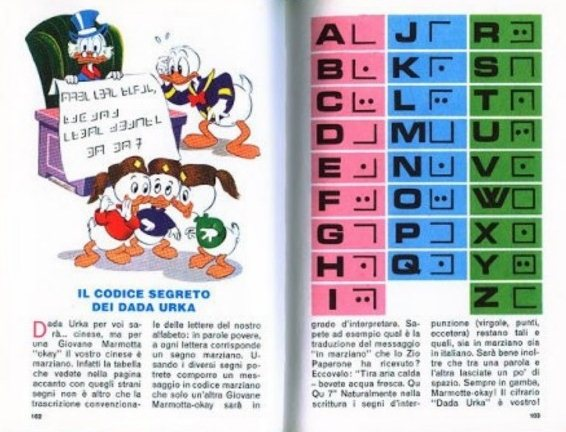
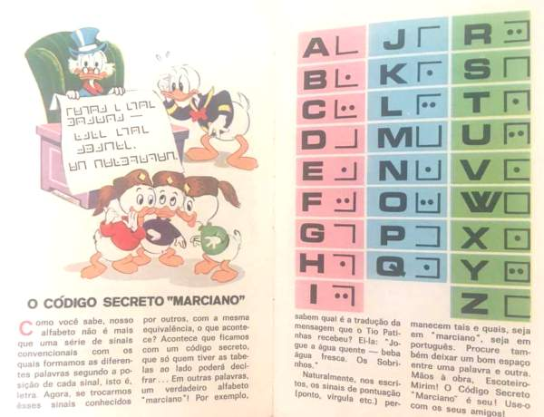
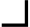
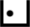
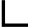
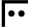
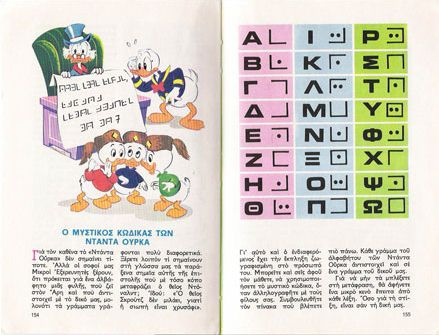
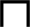
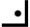

# Dada Urka Cipher

> Source: [https://www.dcode.fr/dada-urka-cipher](https://www.dcode.fr/dada-urka-cipher)
> Retrieved: 2026-08-08
> Attribution: dCode.fr (CC BY notice on the source page).
> Reference-only extract: no converter, solver, API, or implementation code.

## What is the secret code of Dada Urka? (Definition)

The secret code of the Dada Urka is a symbol substitution cipher published in the book Junior Woodchucks Guidebook . The code is presented as the alphabet used by a sect on the planet Mars, but it is largely inspired by the PigPen alphabet of the Freemasons.

## How to encrypt using Dada Urka cipher?

The Dada Ourka code is a substitution of the letters of the alphabet by a symbol according to the illustrations:

Example: DONALD is written

The greek edition has a distinct alphabet for greek characters

## How to decrypt Dada Urka cipher?

The decryption of the Dada Ourka code consists of replacing the symbols with the letter of the corresponding French (or foreign) alphabet.

Example: is translated DISNEY

## How to recognize a Dada Urka ciphertext? (Identification)

The Dada Ourka symbols/glyphs are similar to those of the Pig-Pen code : right corners/angles accompanied by zero, one or two dots. The presence of double dots makes it possible to differentiate it from the Freemasons cipher or the rosicrucian cipher.

All references to Disney's Donald duck, uncle Scrooge, his nephews: Huey, Dewey and Louie (or the Junior Woodchucks) are clues.

Any mention of a Martian sect (from the planet Mars) is also a clue.

## What are the variants of the Dada Urka cipher?

A Greek version has a different translation of the symbols.

dCode is interested in knowing other international versions if they exist.

## When was Dada Urka code invented?

The Junior Woodchucks Guidebook was published near 1970 in several languages.

## Reference Images

