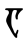
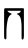
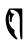
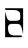
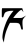
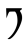
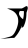
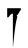
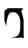
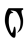

# Daedric Alphabet

> Source: [https://www.dcode.fr/daedric-language](https://www.dcode.fr/daedric-language)
> Retrieved: 2026-08-08
> Attribution: dCode.fr (CC BY notice on the source page).
> Reference-only extract: no converter, solver, API, or implementation code.

## What is the Daedric? (Definition)

The Daedric is the name of an alphabet used by the Daedra, a fictional people of The Elder Scrolls universe. Strictly speaking, there is no Daedric language, but mainly an alphabet.

## How to write in Daedric?

The Daedric alphabet replaces the letters of the Latin alphabet, the correspondences of which are here:

Glyph Name Letter Ayem A Bedt B Cess C Doht D Ekem E Hefhed F Geth G Hekem H Iya I Jeb J Koht K Lyr L Meht M Neht N Oht O Payem P Quam Q Roht R Seht S Tayem T Yoodt U Vehk V Web W Xayah X Yahkem Y Zyr Z

Glyph Name Letter Ayem A Bedt B Cess C Doht D Ekem E Hefhed F Geth G Hekem H Iya I Jeb J Koht K Lyr L Meht M Neht N Oht O Payem P Quam Q Roht R Seht S Tayem T Yoodt U Vehk V Web W Xayah X Yahkem Y Zyr Z

Example: DAEDRA is written

Numbers are not substituted, but tally marks can be used.

## How to translate Daedric messages?

The daedric not being a language, there are no words or vocabulary to translate, but rather to replace the daedric symbols by the letters of the usual alphabet.

Example: is translated OBLIVION

Some texts can be written directly with the names of letters.

Example: Doht Cess Oht Doht Ekem can be read DCODE

## How to recognize a Daedric ciphertext?

A Daedric message is made up of symbols inspired by the Elvish.

All references to The Elder Scrolls (Morrowind, Oblivion, Skyrim) are clues.

## Reference Images

