# Deshret Language (Genshin Impact)

> Source: [https://www.dcode.fr/deshret-language-genshin-impact](https://www.dcode.fr/deshret-language-genshin-impact)
> Retrieved: 2026-08-08
> Attribution: dCode.fr (CC BY notice on the source page).
> Reference-only extract: no converter, solver, API, or implementation code.

## What is Deshret? (Definition)

Deshret is a fictional language featured in the Genshin Impact video game. It is an imaginary writing found in the ruins of great red sand.

## How to write using Deshret script?

Writing in Deshret is based on a system of symbols replacing the letters of the classic alphabet (A to Z) with a Deshret symbol according to the lookup table: A B C D E F G H I J K L M N O P Q R S T U V W X Y Z dCode.fr

A B C D E F G H I J K L M N O P Q R S T U V W X Y Z dCode.fr

Example: DESHRET is written

dCode uses the font created by SpeedyOrc-C on GitHub here ( genshin impact derivatives license)

## How to translate Deshret?

The Deshret translation is a substitution of the symbols of the Deshret alphabet by their corresponding in the English alphabet (see the table above).

Example: corresponds to GENSHIN

## How to recognize a Deshret ciphertext? (Identification)

The Deshret has quite distinctive characters with calligraphy probably inspired by Egyptian hyeroglyphs.

All references to the Genshin Impact video game and its elements copied from Egypt (obelisks, sands, pyramids, etc.) are clues.

## Reference Images

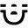
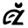
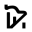
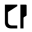
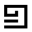
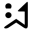
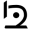
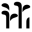
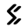
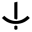
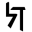
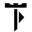
