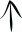

# Dothraki Alphabet

> Source: [https://www.dcode.fr/dothraki-alphabet](https://www.dcode.fr/dothraki-alphabet)
> Retrieved: 2026-08-08
> Attribution: dCode.fr (CC BY notice on the source page).
> Reference-only extract: no converter, solver, API, or implementation code.

## What is the Dothraki alphabet? (Definition)

Dothraki is a fictional language spoken by the warrior people of the Dothraki in the television series Game of Thrones . This language, created by David J. Peterson, is only oral, but fans (Carlos & Patrícia Carrion) have proposed an UNOFFICIAL alphabet inspired by the series and the book Game of Thrones ( A Song of Ice and Fire ) from George RR Martin.

## How to encrypt using Dothraki alphabet?

To write in Dothraki , use the symbols of the Dothraki alphabet according to the correspondence table: A AA B CH D E EE F G H I II J K KH L M N O OO P Q R S SH T TH V W Y Z ZH

A AA B CH D E EE F G H I II J K KH L M N O OO P Q R S SH T TH V W Y Z ZH

Note the absence of the letter C which can be replaced by K or S depending on the pronunciation, the absence of the vowel U and the absence of the consonant X .

Example: DOTHRAKI is written

Spaces are encoded by and commas and periods with the same character

## How to translate Dothraki?

To read Dothraki , begin by replacing each Dothraki symbol/glyph with its corresponding letter(s) (lookup table above).

Example: is translated DAENERYS

The message may be written in spoken Dothraki , so a dictionary translation may be necessary, some fans have suggested translations here

## How to recognize a Dothraki ciphertext? (Identification)

The Dothraki language is recognizable by their visual appearance of curved, sometimes barred features.

All the references to the Game of Thrones series, to the Dothraki nomadic warrior people, to Khals like Drogo, to horses, or to Daenerys are clues.

## What are the variants of the Dothraki alphabet?

The written Dothraki is not an official version, so there are likely other fan variations.

Additionally, the authors of this version also proposed an ancient/old Dothraki , with symbols representing horse, bow, bird or butterfly.

## Reference Images

