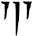
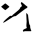
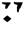
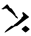
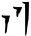
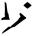
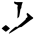
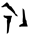
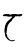
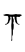

# Draconic Language

> Source: [https://www.dcode.fr/draconic-dragon-language](https://www.dcode.fr/draconic-dragon-language)
> Retrieved: 2026-08-08
> Attribution: dCode.fr (CC BY notice on the source page).
> Reference-only extract: no converter, solver, API, or implementation code.

## What is the Draconic language? (Definition)

Draconic language refers to any communication system attributed to dragons in fantasy worlds. Depending on the fictional world, this language can vary, such as Dovahzul in Skyrim or Iokharic in Dungeons & Dragons.

These languages were designed to mimic what dragons might speak or write and use symbolic alphabets.

## How to write in Draconic?

According to the draconic language used, the writing methods vary, but generally it is about a substitution by symbols which can suggest, from near or far to the writings of dragons.

Example: DCODE in Iokharic :

Example: DCODE in Dovahzul :

## How to read a draconic text?

Go to the dedicated page according to the dragon language used.

## How to recognize Draconic ciphertext?

A draconic message consists of symbols that may possibly recall the claws / scratches of a dragon.

All references to flames or fires or smoke are clues.

The draconic appears in the fantastic universe such as D&D: dungeons and dragons, or in the game The Elder Scrolls V: Skyrim (from Bethesda).

Several dragons have famous names such as the wyvern, the lindworm, the Komodo dragon or Smaug, the dragon from Bilbo the Hobbit (J.R.R. Tolkien).

## Is draconic a real language?

No, the dragon language is not a natural language spoken by real beings.

It is a constructed language (or conlang), invented for fictional worlds.

In these imaginary worlds, dragons exist, and their language and script were created to give coherence and depth to these worlds.

## Reference Images

