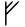
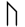
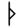
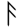
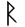
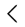

# Elder Futhark ᚠᚢᚦᚨᚱᚲ

> Source: [https://www.dcode.fr/elder-futhark](https://www.dcode.fr/elder-futhark)
> Retrieved: 2026-08-08
> Attribution: dCode.fr (CC BY notice on the source page).
> Reference-only extract: no converter, solver, API, or implementation code.

## What is Elder Futhark? (Definition)

The Old Futhark is a runic alphabet used by the ancient Germans (Germanic people of Northern Europe).

Its name comes from the first six runes of this alphabet: ᚠ,ᚢ,ᚦ,ᚨ,ᚱ,ᚲ

## How to encrypt/write in Elder Futhark?

The runic alphabet used in old futhark is composed of 24 characters, each with a possible transliteration.

ᚠ F ᚢ U ᚦ þ ᚨ A ᚱ R ᚲ K ᚷ G ᚹ W ᚺ H ᚾ N ᛁ I ᛃ J ᛇ Ï ᛈ P ᛉ Z ᛊ S ᛏ T ᛒ B ᛖ E ᛗ M ᛚ L ᛜ Ŋ ᛞ D ᛟ O

ᚠ F ᚢ U ᚦ þ ᚨ A ᚱ R ᚲ K ᚷ G ᚹ W ᚺ H ᚾ N ᛁ I ᛃ J ᛇ Ï ᛈ P ᛉ Z ᛊ S ᛏ T ᛒ B ᛖ E ᛗ M ᛚ L ᛜ Ŋ ᛞ D ᛟ O

To write in old futhark, to associate with each letter or sound of a message in English, his correspondence (or what is nearest) in old futhark according to the table: A ᚨ B ᛒ C ᚲ D ᛞ E ᛖ F ᚠ G ᚷ H ᚺ I ᛁ J ᛃ K ᚲ L ᛚ M ᛗ N ᚾ NG ᛝ O ᛟ P ᛈ Q ᚲ R ᚱ S ᛋ T ᛏ TH ᚦ U ᚢ V ᚹ W ᚹ X Y ᛃ Z ᛉ

A ᚨ B ᛒ C ᚲ D ᛞ E ᛖ F ᚠ G ᚷ H ᚺ I ᛁ J ᛃ K ᚲ L ᛚ M ᛗ N ᚾ NG ᛝ O ᛟ P ᛈ Q ᚲ R ᚱ S ᛋ T ᛏ TH ᚦ U ᚢ V ᚹ W ᚹ X Y ᛃ Z ᛉ

The X has no equivalent, but it can either be replaced by the letters KS , or by the letter G which is transcribed ᚷ in old futhark.

## How to decrypt some Elder Futhark runes?

The decryption of old futhark begins with a substitution of runic characters into Latin characters to obtain an intelligible plain message.

The plain message found may be a text written in some old language, whose translation into English will remain to be done.

Example: ᚠ for f , ᚢ for u , ᚦ for th , ᚨ for a , ᚱ for ' r ', etc.

Example: is read FUTHARK

## How to recognize an Elder Futhark ciphertext?

The alphabet is composed of vertical or sloping/diagonal lines, but never horizontal.

A message can contain a maximum of 24 distinct characters.

Most traces of the old futhark were found on runes, pieces of stones, pebbles on which were engraved runic characters.

The younger futhark is very similar because it is derived from the elder futhark .

Viking runes sometimes use this old Futhark alphabet.

## When was Elder Futhark invented?

Estimation indicates that this language has been spoken by Germanic peoples from the second century to the eighth century AD.

## Reference Images

