# Enochian Alphabet

> Source: [https://www.dcode.fr/enochian-language](https://www.dcode.fr/enochian-language)
> Retrieved: 2026-08-08
> Attribution: dCode.fr (CC BY notice on the source page).
> Reference-only extract: no converter, solver, API, or implementation code.

## What is Enochian? (Definition)

Enochian (or Enokean) is an artificial language invented in the late 16th century by English occultists John Dee and Edward Kelley. According to their writings, this language was revealed to them by angels during spirit communication sessions. It has a specific alphabet and a partial vocabulary, mainly used in magical rituals.

Today, the Enochian is studied both as a historical curiosity and as an element of Western magical tradition.

## How to write in Enochian?

The Enochian alphabet has 21 or 22 letters, depending on the source. Each symbol has a name and an approximate phonetic value.

Users can transcribe words from their own language by replacing each Latin letter with its Enochian equivalent.

Some texts are written from right to left , although this orientation is not always the case.

Here is the correspondence between the Latin letters and their Enochian equivalents: Letter Enochian Name Pronunciation A Un /ɑ/ B Pa /b/ C/K Veh /k/ D Gal /d/ E Graph /e/ F Or /f/ G Ged /dʒ/ H Na /h/ I Gon /iː/ J ≈ G K/C Veh /k/ L Ur /l/ M Tal /m/ N Drux /n/ O Med /oː/ P Mals /p/ Q Ger /q/ R Don /r/ S Fam /s/ T Gisg /t/ U/V Van /uː/ V/U Van /v/ W ≈ V V X Pal /ks/ Y Gon /iː/ Z Ceph /z/

Letter Enochian Name Pronunciation A Un /ɑ/ B Pa /b/ C/K Veh /k/ D Gal /d/ E Graph /e/ F Or /f/ G Ged /dʒ/ H Na /h/ I Gon /iː/ J ≈ G K/C Veh /k/ L Ur /l/ M Tal /m/ N Drux /n/ O Med /oː/ P Mals /p/ Q Ger /q/ R Don /r/ S Fam /s/ T Gisg /t/ U/V Van /uː/ V/U Van /v/ W ≈ V V X Pal /ks/ Y Gon /iː/ Z Ceph /z/

Example: MAGIC is written

Some texts are written in reverse, ie. from right to left .

## How to translate Enochian?

Transcription involves replacing each Enochian symbol with the corresponding Latin letter.

Translation is much more complex: the known vocabulary comes from Dee and Kelley's journals, and there is no comprehensive dictionary or systematic grammar. dCode will nevertheless attempt to translate some words automatically.

Note: Some signs represent multiple possible sounds/letters, such as C/K , G/J , I/Y , and U/V/W .

Some texts are written from right to left .

A few online resources offer transcriptions and attempted translations, such as the Sacred Texts website here

## How to recognize an Enochian ciphertext?

The symbols are strange and esoteric, rather fat and rounded, but this is not an essential feature.

The translated words are usually written in Elizabethan English (late Old English).

The text has at most 22 distinct symbols.

Any references to alchemy, angels (or other spiritual/supernatural entities), sacred language, celestial/angelic scripture, or magic are clues.

The notions of occultism, divination or invocation are generally linked.

## What is the relation between enochian and angels?

John Dee and Edward Kelley claimed that the language was transmitted to them by angels during their spiritual séances.

They considered Enochian to be the original language of Creation, spoken by Adam before the Fall.

However, there is no evidence of such a revealed language. Modern scholars view it primarily as a linguistic construct derived from the mystical and religious culture of the Renaissance.

## How to contact the angels?

In esoteric tradition, Enochian keys (or Enochian Calls) are sequences of words believed to invoke spiritual entities or open celestial spheres.

These practices fall within the realm of spirituality and ceremonial magic.

From a scientific perspective, there is no evidence that it is possible to establish any communication with entities through this method.

## When was enochian invented?

The earliest Enochian texts date from the late 1580s.

John Dee recorded the revelations reported by Edward Kelley, whom he considered a medium/alchemist capable of interpreting the visions received during their séances.

These writings were collected in journals now housed in the British Library.

## Why the name Enochian?

It comes from Enoch, a biblical character believed to have spoken directly with God.

## Reference Images

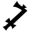
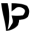
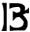
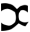
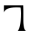
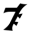
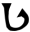
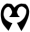
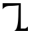
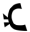
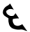
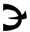
