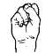
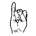
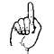
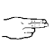
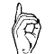
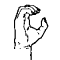
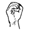
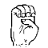

# French Sign Language

> Source: [https://www.dcode.fr/french-sign-language](https://www.dcode.fr/french-sign-language)
> Retrieved: 2026-08-08
> Attribution: dCode.fr (CC BY notice on the source page).
> Reference-only extract: no converter, solver, API, or implementation code.

## How to encrypt using Sign Language (France) cipher?

The sign language encryption can be of two types, either the words are encoded by their own sign or the letters of the words are signed separately.

Example: SIGN can be signed with letters S,I,G,N :

Source of images: langage-des-signes.com

dCode does not offer a sign language dictionary, only the 26 letters of the alphabet from A to Z to spell the words.

## How to decrypt Sign Language (France) cipher?

The decryption of Sign Language is entirely visual. If the words or names have their own sign, then there is no other way than to know them or find them in a dictionary. Otherwise, if the word is spelled, each sign corresponds to a letter.

Example: translates DCODE

## How to recognize Sign Language?

The message is entirely based on the gestures of the arm and especially the hands and fingers.

All references to people who are deaf are a clue.

## Reference Images

