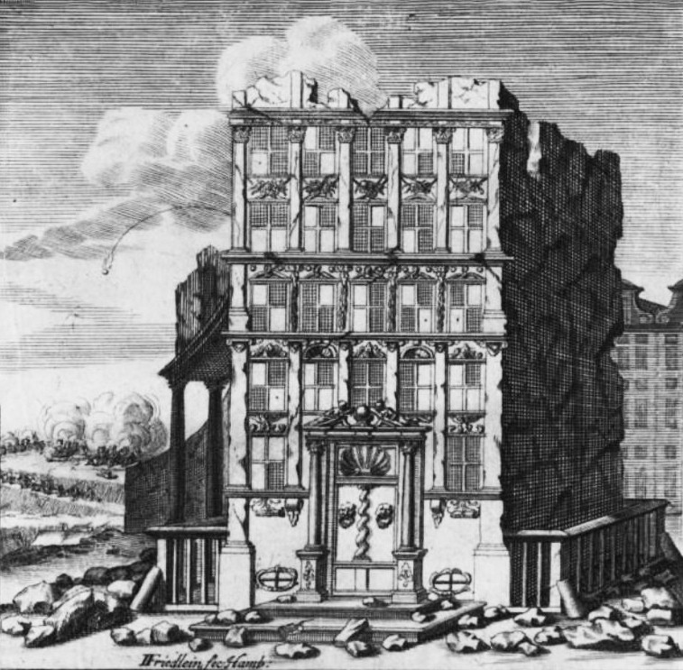

# Friderici Cipher (Windows)

> Source: [https://www.dcode.fr/friderici-windows-cipher](https://www.dcode.fr/friderici-windows-cipher)
> Retrieved: 2026-08-08
> Attribution: dCode.fr (CC BY notice on the source page).
> Reference-only extract: no converter, solver, API, or implementation code.

## What are Friderici's windows? (Definition)

Friderici windows , also known as Fensterchiffre, refers to a graphic encryption system presented by Johann B. Friderici in his work Cryptographia (1685). He includes an illustration of a ruined building with 22 windows, each with 4 panes.

Each window corresponds to a letter of the alphabet, defined by a precise configuration of filled or empty tiles.

## How to encrypt using Friderici's windows cipher?

The Friderici cipher is a substitution of the letters of the alphabet by a window according to the lookup table: A B C D E F G H I K L M N O P Q R S T U W X Y Z dCode.fr

A B C D E F G H I K L M N O P Q R S T U W X Y Z dCode.fr

Note the absence of the letters J and V which did not exist in the (german) alphabet at the time. The X is absent from the drawing but was proposed by Klaus Schmeh.

To encode a message, associate each letter of the text with the corresponding window according to the graphic alphabet provided by Friderici.

## How to decrypt Friderici's windows cipher?

Friderici's deciphering consists of analyzing each window, identifying the configuration of its four panes, and then finding the corresponding letter in the visual alphabet.

Example: The image of the building can be deciphered WIRHABENKEINPULVERMEHR (so wir haben kein pulver mehr that can be translated we have run out of powder )

## How to recognize a Friderici's windows ciphertext? (Identification)

The message appears as a drawing or a set of square or rectangular symbols composed of four sub-squares (cells). In the original version, each square can take on three visual states: blank/white, hatched/striped/black, or marked with a black dot in the center.

These patterns allow the letters to be encoded. Friderici presents this method as a means of concealment, which leads to its integration into facades, building plans, or architectural illustrations, in order to mask an encrypted message within an innocuous setting.

## When was Friderici's windows code invented?

Johann Balthasar Friderici published the book Cryptographia, oder Geheime Schrifft- und würckliche Correspondentz in 1685.

## Reference Images

