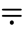
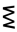
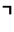
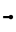
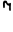
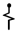
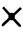
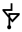
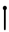
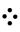

# Futurama Alien 2 Alphabet

> Source: [https://www.dcode.fr/futurama-alien-2-alphabet](https://www.dcode.fr/futurama-alien-2-alphabet)
> Retrieved: 2026-08-08
> Attribution: dCode.fr (CC BY notice on the source page).
> Reference-only extract: no converter, solver, API, or implementation code.

## What is Futurama Alien 2 Alphabet? (Definition)

Futurama Alien 2 alphabet is a fictional alien writing system featured in the animated television series Futurama . It is a an alternative version of the extraterrestrial alphabet used in the Futurama universe.

The alphabet consists of unique symbols representing each letter of the English alphabet, mixed with an autokey cipher.

## How to encrypt using Futurama Alien 2 alphabet?

To encrypt a message using the Futurama Alien 2 alphabet, it is necessary to first encrypt it with a variation of autokey encryption where each letter is assigned a numerical value from A=0, up to Z=25.

Step 1 - the first letter remains unchanged and its value serves as the first key.

Step 2 - add the value of the next letter to the value of the current key, the resulting sum is the value of the encrypted letter. (If the sum result is greater than 25, subtract 26)

Step 3 - use the value obtained in step 2 as a new key and repeat step 2 as long as there are letters.

Step 4 - Convert each letter obtained into an Alien symbol according to the table: A B C D E F G H I J K L M N O P Q R S T U V W X Y Z dCode.fr

A B C D E F G H I J K L M N O P Q R S T U V W X Y Z dCode.fr

Example: ' FUTURAMA ' (values 5,20,19,20,17,0,12,0) is FZSMDDPP (values 5,20+5=25,19+25-26=18,12,3,3 ,15,15) and is written in Alien:

## How to decrypt Futurama Alien 2 alphabet?

Deciphering a message encoded in the Futurama Alien 2 alphabet involves the reverse process of encryption.

Replace each alien symbol with its corresponding letter and decipher the resulting text with the autokey cipher variant:

Step 1 - the first letter remains unchanged.

Step 2 - subtract the value of the next letter from the value of the previous letter, the result obtained is the value of the plain letter. (If the sum result is less than 25, add 26). Repeat step 2 as long as there are letters remaining.

Example: is translated ALTXK then deciphered ALIEN

## How to recognize a Futurama Alien 2 ciphertext?

The alphabet symbols are very angular, only a few have waves.

Any references to Matt Groening's Futurama series (like the characters Fry or Bender) are clues.

If 2 identical symbols are consecutive, then the second is deciphered by the letter A .

## Reference Images

