# Futurama Alien Alphabet

> Source: [https://www.dcode.fr/futurama-alien-alphabet](https://www.dcode.fr/futurama-alien-alphabet)
> Retrieved: 2026-08-08
> Attribution: dCode.fr (CC BY notice on the source page).
> Reference-only extract: no converter, solver, API, or implementation code.

## What is Futurama Alien Alphabet? (Definition)

The Futurama alien alphabet is a fictional writing system used in the animated TV series Futurama to represent the language of aliens.

The Alien 1 alphabet (because there is a second alphabet called Futurama Alien 2) is a symbol substitution cipher.

## How to encrypt using Futurama Alphabet cipher?

To encode a message using the Futurama alien alphabet, replace each letter or number in the original message with the corresponding symbol in the alien alphabet.

A B C D E F G H I J K L M N O P Q R S T U V W X Y Z 0 1 2 3 4 5 6 7 8 9 dCode.fr

A B C D E F G H I J K L M N O P Q R S T U V W X Y Z 0 1 2 3 4 5 6 7 8 9 dCode.fr

Thus any word that can be written with letters or digits will have a translation with as many alien symbols.

Example: FUTURAMA is translated

In some alien text, punctuation may appear like " ' - .: ;

## How to decrypt Futurama Alphabet cipher?

The translation of alien messages consists of replacing symbols with letters or numbers. The text produced is then normally readable in the original language.

Example: is translated ALIEN

## How to recognize a Futurama Alien ciphertext?

The symbols used are quite varied but most contain points at the end of lines (straight lines or curved lines).

The messages are usually hidden in the series, for example in the episode Space Pilot 3000 the message Drink Slurm can be read on a drink and Venusians, Go Home tagged on a wall.

The humor of the series appears from the introduction, on a restaurant called Tasty human burgers and a building has an ad Rent a human . Also in the episode Bender gets made , on an ambulance is written Meat Truck .

The main characters of the series are called Bender and Fry and the creator of the series is Matt Groening (also author of The Simpsons)

## Reference Images

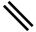
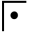
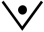
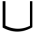
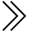
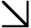
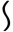
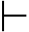
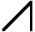
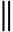
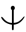
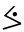
