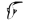
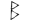
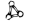
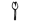
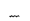
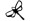
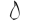
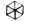
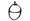
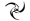

# Gnommish Language

> Source: [https://www.dcode.fr/gnommish-alphabet](https://www.dcode.fr/gnommish-alphabet)
> Retrieved: 2026-08-08
> Attribution: dCode.fr (CC BY notice on the source page).
> Reference-only extract: no converter, solver, API, or implementation code.

## What is Gnomish? (Definition)

The Gnommish Language, or Gnomish , is a fictional writing system invented by Eoin Colfer for the Artemis Fowl universe. It is used by fairy creatures, particularly gnomes and fairies.

In the books, Gnommish symbols run along the pages and conceal secret messages.

The author specifies that this writing system is the ancestor of Egyptian hieroglyphs.

## How to write/translate in gnomic language?

The Gnomic alphabet is composed of 28 characters replacing the 26 letters of the Latin/English alphabet plus 2 additional characters: the character . (point) and spacing (space).

Example: GNOME translates to

The character E is a kind of underlining, it can apply to the previous letter if it exists. dCode does not apply underlining for simplicity and clarity of display.

## How to translate from gnommish language?

Each of the gnomic symbols translates into one of the letters of the English/Latin alphabet (or a punctuation like point or space ).

Example: translates ARTEMIS

In the books of the Artemis Fowl series are some words that are not a substitution like ka-dalun , P'shóg , D'Arvit , cowpóg or ffurforfer .

## How to recognize a gnommish ciphertext?

The characters of the alphabet are symbols seeming to recall hieroglyphs, they consist of drawings of everyday objects or animals or plants such as a leaf, a butterfly, a snail, a crab, a key or an eye.

In Artemis Fowl and the Eternity Code it is stated that, in the past, the Bible was written in a spiral, but more recently the writing has come by lines like humans.

The word D'arvit is an interjection similar to a swear/curse/bad word.

dCode uses the work of The Phlegm Pot here

## What is the difference between Gnommish and Gnomish?

Gnomish (with 1 m ) is the English adjective to qualify things about gnomes . Gnommish (with 2 m ) is the name of the language above used in Artemis Fowl and invented by Eoin Colfer.

## Reference Images

