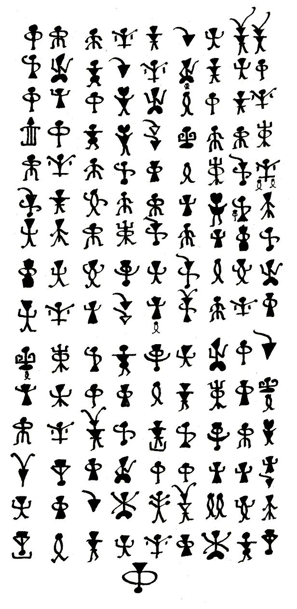
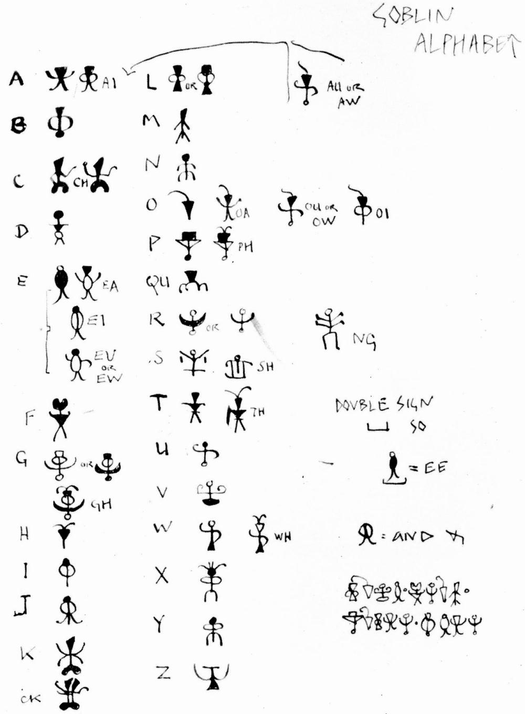
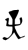
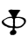
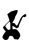
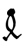
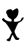
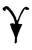
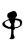
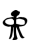

# Goblin Tolkien Alphabet

> Source: [https://www.dcode.fr/goblin-tolkien-alphabet](https://www.dcode.fr/goblin-tolkien-alphabet)
> Retrieved: 2026-08-08
> Attribution: dCode.fr (CC BY notice on the source page).
> Reference-only extract: no converter, solver, API, or implementation code.

## What is Tolkien's goblin alphabet? (Definition)

Tolkien's Goblin Alphabet is a writing system invented by J.R.R. Tolkien as part of his Letters from Santa Claus. It was used to write letters and messages as part of his stories for his children in the 1930s.

## What are Tolkien's Goblin Letters?

Only 2 examples of use of the alphabet remain, the first is a letter from December 23, 1932 where JRR Tolkien pretends to be Karhu, a polar bear, written with these humanoid figures:

The letter is written vertically in 9 columns by 15 lines (it is read from top to bottom and from left to right), it translates: I Y N S T O A TH TH W CH D O S CL T A I I R I F CH E I T S SH I D F OO V N Y AND Y S N U L E AND OU SEE OU T EW N Y R F WI M A M Y AND OU N R L U L A EA G A OW E EA CH A S R OO RE WH N S L VE AND W D G A CH I O R A I L E T AND L VE Y S TH U TT W G Y F H P L C I I R R RO A L O K NG TH EE EA M PP E T A S L K D P

I Y N S T O A TH TH W CH D O S CL T A I I R I F CH E I T S SH I D F OO V N Y AND Y S N U L E AND OU SEE OU T EW N Y R F WI M A M Y AND OU N R L U L A EA G A OW E EA CH A S R OO RE WH N S L VE AND W D G A CH I O R A I L E T AND L VE Y S TH U TT W G Y F H P L C I I R R RO A L O K NG TH EE EA M PP E T A S L K D P

So I WISH YOU AL(L) A VERY HAPPY CHRISTMAS AND A SPLENDID NEW YEAR WITH LOTS OF FUN AND GOOD LUCK AT SCHOOL. YOU ARE GETTING SO CLEVER NOW WHAT WITH LATIN AND FRENCH AND GREEK THAT YOU WIL(L) EASILY READ THIS AND SEE MUCH LOVE FROM P

Then, in 1936, a correspondence table allowing the translation of the goblin alphabet was disclosed, it proposed symbols never used in the first letter.

It also contains a small message of 17 symbols which resembles the truncated end of the letter, this time written horizontally which translates: LOVE FROM POLAR BEAR

## How to encrypt using the goblin alphabet?

To encode a message using the Goblin Alphabet, replace each letter of the Latin alphabet with the corresponding character of the Goblin alphabet. Here are the 26 goblin symbols for the 26 letters of the English alphabet: A B C D E F G H I J K L M N O P Q R S T U V W X Y Z dCode.fr

A B C D E F G H I J K L M N O P Q R S T U V W X Y Z dCode.fr

The alphabet also includes several sets of goblin characters corresponding to groups of 2 or more letters.

First there are the useful bigrams in English: CK , NG , GH , SH , TH , TH , WH , etc.

Then there is the character which indicates a repetition of the underlined letter.

Example: translates EE (and could be written )

Finally, there are the errors made by JRR Tolkien during his transcription, often omissions, containing added symbols like or

## How to decrypt the goblin alphabet?

To decode a message written in the Gobelin Alphabet, use the correspondence table between the Gobelin Alphabet and the English alphabet.

Example: is translated TOLKIEN

## How to recognize a goblin ciphertext? (Identification)

Tolkien's Goblin Alphabet is recognizable by its humanoid/goblinoid characters (goblin-type characters) with triangular, round or square heads.

All references to goblins, JRR Tolkien and the worlds of his books are clues.

dCode reused the work of BabelStone here (SIL Open Font License 1.1)

## Reference Images

