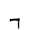
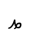
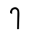
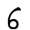
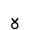
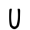
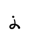
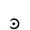
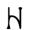

# Goron Language

> Source: [https://www.dcode.fr/goron-cipher](https://www.dcode.fr/goron-cipher)
> Retrieved: 2026-08-08
> Attribution: dCode.fr (CC BY notice on the source page).
> Reference-only extract: no converter, solver, API, or implementation code.

## What is the Goron? (Definition)

Goron is a fictional writing system from the world of the video game The Legend of Zelda. It is used by the Goron people to visually represent messages.

Unlike a complete language, Goron has neither its own grammar nor vocabulary: it is a graphic substitution alphabet used to transcribe existing languages (such as French or English) character by character.

## How to write/encrypt in Goron?

Writing or encoding in Goron involves applying a substitution cipher: each character in English (alphabet or numbers or punctuation) is replaced by a unique Goron symbol.

A B C D E F G H I J K L M N O P Q R S T U V W X Y Z 0 1 2 3 4 5 6 7 8 9 dCode.fr

A B C D E F G H I J K L M N O P Q R S T U V W X Y Z 0 1 2 3 4 5 6 7 8 9 dCode.fr

Example: ZELDA translates to

Accents, diacritics, and other rare non-alphabetic characters do not appear in the game and therefore do not have a Goron symbol.

## How to decrypt Goron language/cipher?

Decoding Goron involves performing the reverse operation of encoding: each Goron symbol is replaced by the corresponding letter or number using the Goron lookup table (above).

Example: is translated GORON

## How to recognize a Goron ciphertext?

The letters are represented by sometimes rounded and sometimes straight symbols that blend into the Zelda/Link universe. On the contrary, the digits are similar to the Roman numerals .

Not all characters are the same size, so the message alternates between tall and small characters.

The symbol of the Gorons has a form of pet leg with 3 fingers, a form of losange, with 3 triangles.

Any reference to Darunia, the goron leader or Darmani, a goron warrior, or any other Zelda character are clues.

The Goron writing system appears notably in Ocarina of Time and Majora's Mask, mainly on signs, stelae and decorative elements.

## Reference Images

