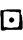

# Gravity Falls Alchemy Cipher

> Source: [https://www.dcode.fr/gravity-falls-alchemy](https://www.dcode.fr/gravity-falls-alchemy)
> Retrieved: 2026-08-08
> Attribution: dCode.fr (CC BY notice on the source page).
> Reference-only extract: no converter, solver, API, or implementation code.

## What is the Alchemic cipher from Gravity Falls? (Definition)

In the book Gravity Falls : The Book of Bill several secret codes are hidden, one of them was first named Cipheric then Alchemic when it was discovered that it is alchemy symbols from a font called 1651 Alchemy .

## How to encrypt using Alchemic cipher?

The Alchemic Code is a substitution of the 26 letters of the alphabet by 26 alchemy symbols according to the table: A B C D E F G H I J K L M N O P Q R S T U V W X Y Z dCode.fr

A B C D E F G H I J K L M N O P Q R S T U V W X Y Z dCode.fr

Example: BILL is translated

## How to decrypt Alchemic cipher?

The decoding of alchemical symbols is based on a mono-alphabetic substitution , where each alchemy symbol is replaced by a letter of the alphabet, according to the table presented above.

Example: is decoded GRAVITY

## How to recognize a Alchemic/Cipheric ciphertext? (Identification)

The message is composed of alchemy symbols, themselves essentially made up of circles, lines and crosses (in the shape of a +) and sometimes triangles.

Any references to the book The Book of Bill or to the characters of Gravity Falls are clues.

The 1651 Alchemy font is a creation of Gilles Le Corre here

## Reference Images

