# Gravity Falls The Author

> Source: [https://www.dcode.fr/gravity-falls-author-cipher](https://www.dcode.fr/gravity-falls-author-cipher)
> Retrieved: 2026-08-08
> Attribution: dCode.fr (CC BY notice on the source page).
> Reference-only extract: no converter, solver, API, or implementation code.

## What is the Author cipher? (Definition)

In Gravity Falls , the series and the books, symbols similar to those used by Bill (see all Gravity Falls codes) appear, they come from a mysterious author .

## How to encrypt using The Author cipher?

The Author in Gravity Falls has his own alphabet with 26 symbols, one for each letter from the Latin alphabet. To encrypt a message with The Author cipher is a replacement of each letter with the corresponding symbol. Letter Symbol Letter Symbol A B C D E F G H I J K L M N O P Q R S T U V W X Y Z dCode.fr

Letter Symbol Letter Symbol A B C D E F G H I J K L M N O P Q R S T U V W X Y Z dCode.fr

Example: GRAVITY is written

## How to decrypt The Author cipher?

The Author cipher (from Gravity Falls ) has its own alphabet of 26 symbols and their correspondance with the classic letters of the Latin alphabet. The Author decryption consists in replacing these symbols to get the original plain message.

Example: is translated JOURNAL

Some cryptograms are sometimes written with mirror writing (the symbols are symmetrically reversed, the text is then written from right to left )

## How to recognize a The Author ciphertext?

The symbols used by The Author are similar to the hieroglyphs and to others codes used in Gravity Falls .

## Who is The Author? (Spoiler Alert)

The Author is revealed in the second part of Season 2 of Gravity Falls . The author is Ford Pines, the twin brother of Stan Pines he lost sight a long time ago because he disappeared into another dimension, but his research was recorded in a series of journals.

Other Gravity Falls info here (affiliate link)

## Reference Images

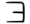
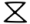
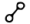
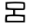
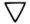
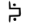
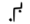
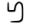
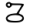
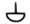
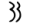
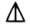
