# Gravity Falls Bill Cipher

> Source: [https://www.dcode.fr/gravity-falls-bill-cipher](https://www.dcode.fr/gravity-falls-bill-cipher)
> Retrieved: 2026-08-08
> Attribution: dCode.fr (CC BY notice on the source page).
> Reference-only extract: no converter, solver, API, or implementation code.

## What is the Bill Cipher's cipher? (Definition)

Bill Cipher is the main antagonist of the Gravity Falls series, he uses in some episodes and the book a code in cryptogram form consisting of symbols to write messages.

In a message in Journal 3 , the code translates to I CALL THIS FORDESE and so some call this code FORDESE

## How to encrypt using Bill Cipher cipher?

Bill Cipher has his own alphabet of 26 symbols, each corresponding to a letter of the Latin alphabet. To encrypt a message with Bill Cipher is therefore to replace each letter with the corresponding symbol.

A B C D E F G H I J K L M N O P Q R S T U V W X Y Z dCode.fr

A B C D E F G H I J K L M N O P Q R S T U V W X Y Z dCode.fr

Example: BILL is written

## How to decrypt Bill Cipher cipher?

Bill Cipher uses an alphabet of 26 symbols corresponding to the classic letters of the Latin alphabet. Decryption is to replace these symbols to get the original plain message.

Example: is translated GRAVITY

Sometimes the message is over-encrypted with a Caesar code or additional mono-alphabetic substitution .

## How to recognize a Bill Cipher ciphertext?

The symbols used by Bill Cipher are similar to the hieroglyphs.

Another code used in Gravity Falls , the Author's code has similar or even identical symbols.

In Gravity Falls , Bill has a triangle shape, he has only one eye, wears a hat and a bow tie, he is sometimes likened to the eye of providence, its presence could be a clue.

## Reference Images

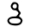
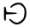
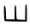
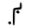
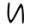
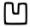
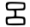
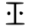
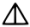
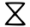
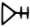
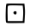
