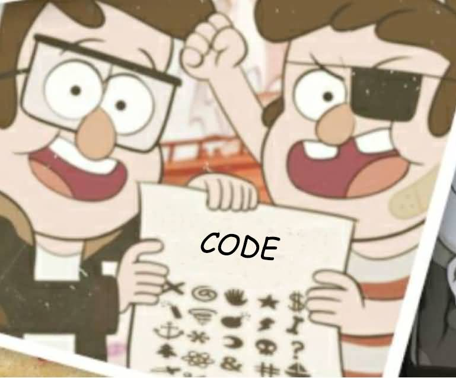
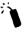

# Gravity Falls Bros' Code

> Source: [https://www.dcode.fr/gravity-falls-bros-code](https://www.dcode.fr/gravity-falls-bros-code)
> Retrieved: 2026-08-08
> Attribution: dCode.fr (CC BY notice on the source page).
> Reference-only extract: no converter, solver, API, or implementation code.

## What is the Bros' Secret cipher from Gravity Falls? (Definition)

In the book Gravity Falls : The Book of Bill, a code titled Bros' Secret Code appears on a photo of brothers Stanley and Ford as children.

## How to encrypt using Bros' Secret cipher?

The brothers' secret code probably contains 26 characters,but the image is cut off and only 21 (or even 22) symbols are visible. The translation table is as follows: A B C D E F G H I J K L M N O P Q R S T U V Y dCode.fr

A B C D E F G H I J K L M N O P Q R S T U V Y dCode.fr

Example: BROS is translated

The letters W to Z were deduced from cryptograms in the book or from the website thisisnotawebsite.

## How to decrypt Bros' Secret cipher?

The decoding of the Bros' Secret code symbols is a mono-alphabetic substitution , that is, a replacement of the symbols with the corresponding letters.

Example: The message is translated by DCODE

## How to recognize a Bros' Secret ciphertext? (Identification)

The Bros' Secret alphabet is a collection of very common symbols, and they all have a Unicode equivalent.

The Unicode translation is approximate, besides the colors which are missing in the book, several details differ, like the hand symbol contains 5 fingers while it has 6 in the original code.

Page 161 of The Book of Bill contains the only known alphabet, but it is incomplete.

## Reference Images

