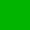
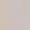

# Gravity Falls Color Code

> Source: [https://www.dcode.fr/gravity-falls-colors](https://www.dcode.fr/gravity-falls-colors)
> Retrieved: 2026-08-08
> Attribution: dCode.fr (CC BY notice on the source page).
> Reference-only extract: no converter, solver, API, or implementation code.

## What is the Colors cipher from Gravity Falls? (Definition)

The book Gravity Falls : The Book of Bill contains several sets of colors that represent coded messages. The alphabet (named Colors) used has been deciphered by fans and allows the messages in the book to be decoded.

The website thisisnotawebsitedotcom also contains several cryptograms using the same color code.

## How to encrypt using Colors cipher?

The Colors code contains 26 colors associated with 26 letters of the alphabet. The correspondences are as follows: A B C D E F G H I J K L M N O P Q R S T U V W X Y Z dCode.fr

A B C D E F G H I J K L M N O P Q R S T U V W X Y Z dCode.fr

Example: COLORS translates

## How to decrypt Colors cipher?

Color decoding is a mono alphabetic substitution replacing the 26 colors with the letters A to Z.

Example: The colors translate DCODE

Depending on the medium used (book or website) some colors may vary slightly (different colors on screen or due to printing).

Word endings are sometimes indicated with a colored rectangle larger than the others.

## How to recognize a Colors ciphertext? (Identification)

The color code is a series of 26 colors apparently selected at random.

The book The Book of Bill and the website thisisnotawebsitedotcom use this code.

## Reference Images

