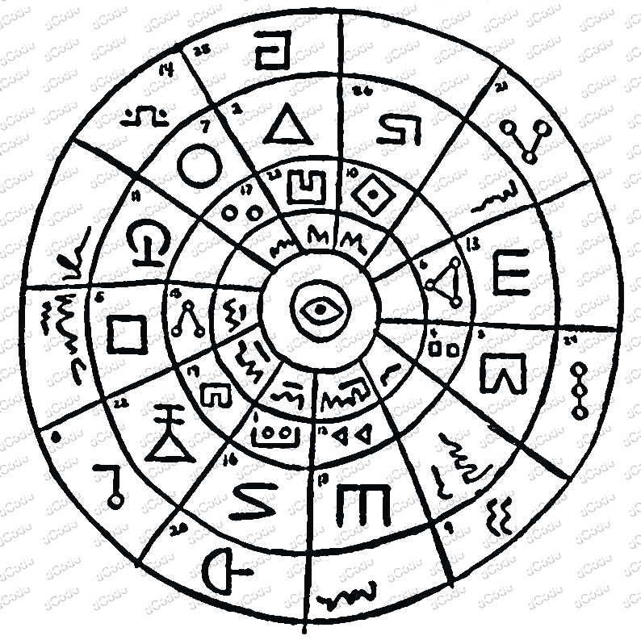
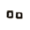
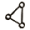
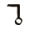
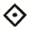

# Gravity Falls Journal 3

> Source: [https://www.dcode.fr/gravity-falls-journal-3-cipher](https://www.dcode.fr/gravity-falls-journal-3-cipher)
> Retrieved: 2026-08-08
> Attribution: dCode.fr (CC BY notice on the source page).
> Reference-only extract: no converter, solver, API, or implementation code.

## What is Gravity Falls: Journal 3 cipher? (Definition)

In Gravity Falls (the series or the books), several ciphers are used, one of them appears in Journal 3 , it combines symbols from other codes ( Bill Cipher 's and the Author's). Some call this code combined .

The cipher is presented in concentric circles (a wheel), with, next to each symbol, a number between 1 and 26 to make it correspond to a letter (see figure A1Z26 ).

## How to encrypt using Gravity Falls: Journal 3 cipher?

The Journal cipher 3 is a substitution of the alphabet by 26 symbols as follows:

A B C D E F G H I J K L M N O P Q R S T U V W X Y Z dCode.fr

A B C D E F G H I J K L M N O P Q R S T U V W X Y Z dCode.fr

Example: JOURNAL is written

## How to decrypt Gravity Falls: Journal 3 cipher?

The Journal 3 decryption replaces the symbols with the corresponding letters to get the plain message.

Example: is translated to the word GRAVITY

## How to recognize a Journal 3 ciphertext?

The symbols used in Journal 3 are similar or even identical to the other symbols of Gravity Falls : those of Bill Cipher 's code and those of the Author.

Visually they are similar to hieroglyphs.

## Reference Images

