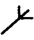
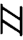

# Gravity Falls Rune Cipher

> Source: [https://www.dcode.fr/gravity-falls-runic](https://www.dcode.fr/gravity-falls-runic)
> Retrieved: 2026-08-08
> Attribution: dCode.fr (CC BY notice on the source page).
> Reference-only extract: no converter, solver, API, or implementation code.

## What is the Runic cipher from Gravity Falls? (Definition)

In the book Gravity Falls : The Book of Bill various secret codes based on symbols are present, one of them compiles various drawings inspired by runes ( Runic ) and the alphabet is revealed in the book page 111 on a sort of tombstone.

## How to encrypt using Runic cipher?

The Runic code consists of replacing the 26 letters of the alphabet with 26 rune symbols, according to the following table: A B C D E F G H I J K L M N O P Q R S T U V W X Y Z dCode.fr

A B C D E F G H I J K L M N O P Q R S T U V W X Y Z dCode.fr

Example: BILL is encoded

## How to decrypt Runic cipher?

Decoding alchemy symbols is a mono alphabetic substitution , replacing each alchemical symbol with a letter of the alphabet according to the table above.

Example: translates to GRAVITY

## How to recognize a Runic ciphertext? (Identification)

The message is composed of runic symbols (a character inspired by Scandinavian/Nordic writing).

Runic characters are often recognizable by their distinctive, angular shape: runes have straight lines and sharp angles. They are often depicted carved into stone.

The page of the book on which the Runic alphabet is found is called Cipherstition (a portmanteau of cipher and superstition).

Any reference to the book The Book of Bill or the Gravity Falls series is a clue.

## Reference Images

