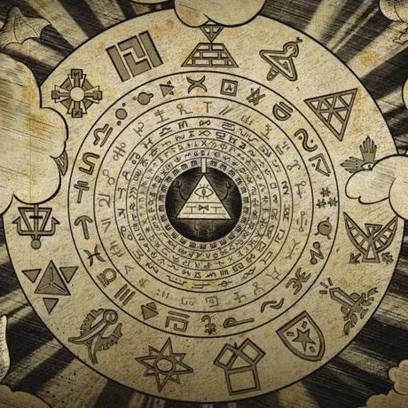
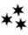

# Gravity Falls Theraprism Cipher

> Source: [https://www.dcode.fr/gravity-falls-theraprism](https://www.dcode.fr/gravity-falls-theraprism)
> Retrieved: 2026-08-08
> Attribution: dCode.fr (CC BY notice on the source page).
> Reference-only extract: no converter, solver, API, or implementation code.

## What is the Theraprism cipher from Gravity Falls? (Definition)

In the book Gravity Falls : The Book of Bill, a series of 4 encrypted messages appear with symbols depicted in Season 2, Episode 15 (during a nightmare Ford has).

Theraprism is a neutral zone outside of time and space dedicated to the rehabilitation of deceased beings like Bill Cipher , who was sent there after his death to undergo compulsory therapy in preparation for possible reincarnation.

## How to encrypt using Theraprism cipher?

The Theraprism code contains 25 characters, replacing the first 25 letters of the alphabet (a priori, the Z does not exist, at least, it is not used) according to the table: A B C D E F G H I J K L M N O P Q R S T U V W X Y dCode.fr

A B C D E F G H I J K L M N O P Q R S T U V W X Y dCode.fr

Example: FORD is translated

The other characters (number, punctuation or symbol) have no equivalent (at least, nothing is mentioned in the book).

## How to decrypt Theraprism cipher?

The decoding of the symbols of Theraprism is based on a monoalphabetic substitution : each symbol corresponds to a single letter of the alphabet, from A to Y.

Example: The code is the translation of DCODE

## How to recognize a Theraprism ciphertext? (Identification)

The Theraprism alphabet is a collection of symbols that does not seem to have any structure. Each symbol is unique, the shapes vary, some are geometric (circles, triangles, squares), others are small drawings (stars, arrows, etc.), others are based on lines and curves.

The book The Book of Bill and episode 15 (season 2) of Gravity Falls (The Last Mabelcorn, an episode with unicorns) seem to be the first appearances of the code.

## Reference Images

