# Hexahue

> Source: [https://www.dcode.fr/hexahue-cipher](https://www.dcode.fr/hexahue-cipher)
> Retrieved: 2026-08-08
> Attribution: dCode.fr (CC BY notice on the source page).
> Reference-only extract: no converter, solver, API, or implementation code.

## What is Hexahue? (Definition)

Hexahue is an alphabet made of colored blocks created from squares arranged in a 2x3 rectangle. The idea was to create a writing system based on bright colors and limited to 9 HTML colors .

## How to encrypt using Hexahue cipher?

Hexahue uses 9-color square patterns within a 2x3 rectangular grid.

Hexahue supports 38 characters: the 26 characters of the Latin alphabet (from A to Z), the 10 digits (from 0 to 9) as well as the comma , , the period . , presented in the following table:

A B C D E F G H I J K L M N O P Q R S T U V W X Y Z 0 1 2 3 4 5 6 7 8 9 . , dCode.fr

A B C D E F G H I J K L M N O P Q R S T U V W X Y Z 0 1 2 3 4 5 6 7 8 9 . , dCode.fr

Hexahue additionally uses 2 blocks to represent spaces, either ▮ or ▯ (one all black and one all white).

Example: HEXAHUE is coded

The correspondence is 1 to 1: a letter/number always corresponds to a symbol (for letters, upper and lower case are not differentiated).

In his original description, the author indicated that the other punctuations ( .,()[]{}!?%$-+/* ) could be achieved by combining other black and white square patterns.

## How to translate Hexahue cipher?

Hexahue decryption consists of the transcription of colored rectangles into plain letters or numbers according to the correspondence table above.

Example: is translated DCODE

## How to recognize a Hexahue ciphertext?

Any message encrypted by Hexahue is in a rather colorful image format with a maximum of 9 distinct colors: red, green, blue, yellow, cyan, magenta, white, gray and black.

Each color is theoretically present at 100% brightness (except for gray).

The symbols are made up of combinations of 6 colored squares grouped into a rectangle 3 high by 2 wide.

The letters are coded with the 6 primary and secondary colors: red, green, blue, yellow, cyan, magenta and never have the same color twice.

The digits/figures are coded with 3 levels of gray: white, gray and black, with mandatory 2 squares of each shade.

The punctuation (the point . And the comma , ) is coded with only black and white (3 black squares and 3 white squares staggered)

The spaces are either all black or all white.

The prefix HEX refers to the fact that there are 6 colors, but can also refer to the hexadecimal code for denoting HTML colors .

The author calls hexasquare each of the 6 small squares making up a hexahue symbol.

## Who invented Hexahue?

Hexahue was invented by Josh Cramer. Source here

## Reference Images

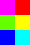
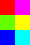
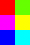
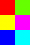
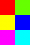
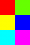
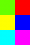
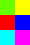
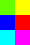
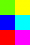
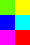
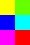
