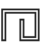
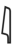
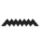
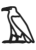
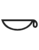

# Hieroglyphs (Manuel de Codage)

> Source: [https://www.dcode.fr/hieroglyphs-mdc](https://www.dcode.fr/hieroglyphs-mdc)
> Retrieved: 2026-08-08
> Attribution: dCode.fr (CC BY notice on the source page).
> Reference-only extract: no converter, solver, API, or implementation code.

## What is the Hieroglyphs' Manuel de Codage? (Definition)

The Hieroglyph Manuel de Codage (Coding Manual - MdC) is a standardized system for encoding and decoding Egyptian hieroglyphs. It allows complex hieroglyphic symbols to be represented using a series of alphanumeric codes.

## How to encrypt hieroglyphs using the Manuel de Codage?

To encode messages in the form of hieroglyphs according to the Coding Manual, consult the MdC tables to find the corresponding symbol: A 𓄿 B 𓃀 D 𓂧 F 𓆑 G 𓎼 H 𓉔 I 𓇋 K 𓎡 L 𓃭 M 𓅓 N 𓈖 P 𓊪 Q 𓈎 R 𓂋 S 𓋴 T 𓏏 W 𓅱 X 𓐍 Y 𓇌 Z 𓊃

A 𓄿 B 𓃀 D 𓂧 F 𓆑 G 𓎼 H 𓉔 I 𓇋 K 𓎡 L 𓃭 M 𓅓 N 𓈖 P 𓊪 Q 𓈎 R 𓂋 S 𓋴 T 𓏏 W 𓅱 X 𓐍 Y 𓇌 Z 𓊃

Example: The 6 letters S,P,H,I,N,X forming the word SPHINX are equivalent to

The manual includes thousands of signs, but only 20 are coded with a single letter. It is therefore not possible to code words in English that contain the letters C,E,J,O,U,V .

## How to decrypt hieroglyphs using the Manuel de Codage?

To decode hieroglyphs using the Coding Handbook, first identify the sign/symbol/glyph to be decoded. Then consult the MdC tables to find the letter corresponding to this sign: 𓄿A 𓇋i 𓏭y 𓇌y 𓂝a 𓅱w 𓏲W 𓃀b 𓊪p 𓆑f 𓅓m 𓐝M 𓈖n 𓋔N 𓂋r 𓃭l 𓉔h 𓎛H 𓐍x 𓄡X 𓊃z 𓋴s 𓈙S 𓈎q 𓎡k 𓎼g 𓏏t 𓍿T 𓂧d 𓆓D

𓄿A 𓇋i 𓏭y 𓇌y 𓂝a 𓅱w 𓏲W 𓃀b 𓊪p 𓆑f 𓅓m 𓐝M 𓈖n 𓋔N 𓂋r 𓃭l 𓉔h 𓎛H 𓐍x 𓄡X 𓊃z 𓋴s 𓈙S 𓈎q 𓎡k 𓎼g 𓏏t 𓍿T 𓂧d 𓆓D

This list of 30 hieroglyphs is limited to symbols that have a uniliteral correspondence (1 hieroglyph = 1 letter of the alphabet)

Example: The 4 symbols are coded with the 4 letters ankh in the MdC coding manual.

## How to recognize hieroglyphs from the MdC?

Uniliteral hyeroglyphs in the Manuel de Codage (coding manual) are limited to 30 distinct ones.

All references to Egypt, its pyramids, pharaohs, its sphinx, are clues.

## Reference Images

