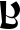

# Hylian Language (A Link Between Worlds)

> Source: [https://www.dcode.fr/hylian-language-a-link-between-worlds](https://www.dcode.fr/hylian-language-a-link-between-worlds)
> Retrieved: 2026-08-08
> Attribution: dCode.fr (CC BY notice on the source page).
> Reference-only extract: no converter, solver, API, or implementation code.

## How to write in Hylian, as in Zelda A Link Between Worlds?

The Hylian language is used in the videogame A Link Between Worlds but it was already present in past Zelda games (Hyrule world), it is rather an evolution of the Hylian language.

To write a message in Hylian, replacing each letter with its associated Hylian symbol. A B C D E F G H I J K L M N O P Q R S T U V W X Y Z dCode.fr

A B C D E F G H I J K L M N O P Q R S T U V W X Y Z dCode.fr

This alphabet contains duplicate symbols undifferentiated: D=G , E=W , F=R , J=T and O=Z .

There is no punctuation or difference between upper and lower case . For numbers, it is recommended to write the numbers in letters before translating.

Example: HYLIAN becomes

## How to decrypt Hylian from Zelda A Link Between Worlds?

Each Hylian symbol is the equivalent of a letter of the alphabet, decode a slogan to translate the symbol by its letter.

The difficulty is to manage the symbols being worth 2 letters D = G , E = W , F = R , J = T and O = Z .

Example: translates ZELDA

## How to recognize an Hylian A Link Between Worlds ciphertext?

The message is composed of rounded designs that may look like Latin characters. Any reference to Zelda's game or universe is a clue.

There exists multiple variations of the Hylian language that appears gradually with new Zelda games.

## What are the variants of the Hylian A Link Between Worlds cipher?

The hylian symbols in A Link Between Worlds are evolutions of Hylian Skyward Sword symbols themselves an evolution of hylian from Twilight Princess .

## Reference Images

