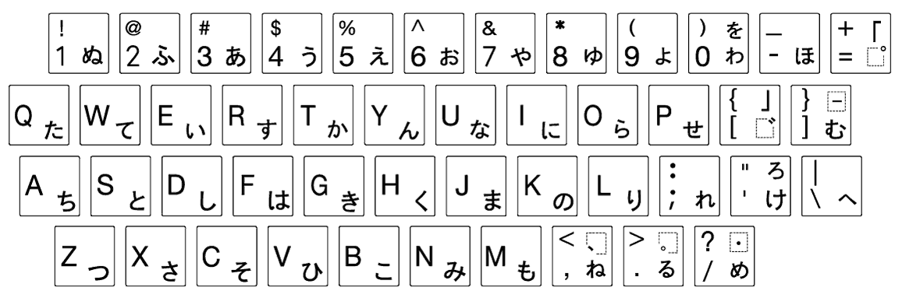

# JIS Keyboard (みかか Mikaka)

> Source: [https://www.dcode.fr/jis-keyboard-mikaka](https://www.dcode.fr/jis-keyboard-mikaka)
> Retrieved: 2026-08-08
> Attribution: dCode.fr (CC BY notice on the source page).
> Reference-only extract: no converter, solver, API, or implementation code.

## What is a JIS keyboard? (Definition)

A JIS (Japanese Industrial Standard) keyboard is a type of keyboard layout designed specifically for the Japanese language. It follows Japanese industrial standards, allowing for typing both Roman characters (romaji) and Japanese scripts (hiragana, katakana, and kanji).

The keys Q , W , E , R , T , Y are mapped to た , て , い , す , か , ん ( ta , te , i , su , ka , n )

## What is みかか Mikaka?

The Mikaka conversion method uses the standard key layout on a JIS (Japanese) keyboard. By using a Japanese keyboard and typing alphabetic letters, it is possible to directly write the corresponding hiragana.

Example: NTT produces みかか

The term みかか Mikaka refers to NTT (the Japanese telecommunications company) and has become a nickname for the company as well as the name given to this form of writing used as a form of obfuscation or encoding to transform texts.

## How to decode/convert Mikaka?

From the standard JIS keyboard layout, it is possible to define the key mapping that allows translation.

By default, uppercase letters should not be converted, as they are incompatible with the physical operation of the keyboard, but dCode treats them as lowercase.

## How to recognize Mikaka writing? (Identification)

The encoded text is made up of hiragana characters that are meaningless in Japanese.

## Reference Images

