# Kirby (Forgotten Land) Alphabet

> Source: [https://www.dcode.fr/kirby-forgotten-land-alphabet](https://www.dcode.fr/kirby-forgotten-land-alphabet)
> Retrieved: 2026-08-08
> Attribution: dCode.fr (CC BY notice on the source page).
> Reference-only extract: no converter, solver, API, or implementation code.

## What is Kirby and the Forgotten Land alphabet? (Definition)

In several places in the forgotten world of the video game Kirby and the Forgotten Land , signs and other writings are inscribed with characters/glyphs unique to the game. Several players then tried to decode these writings and deduced an alphabet from the forgotten world of Kirby.

## How to encrypt using Forgotten Land alphabet?

A message in English is written in Kirby by replacing each letter (or number) with a symbol of the alphabet of the forgotten world.

A B C D E F G H I J K L M N O P Q R S T U V W X Y Z 0 1 2 3 4 5 6 7 8 9 ! ? dCode.fr

A B C D E F G H I J K L M N O P Q R S T U V W X Y Z 0 1 2 3 4 5 6 7 8 9 ! ? dCode.fr

Example: KIRBY is translated

Upper and lower case letters are indistinguishable.

## How to decrypt a Forgotten Land alphabet message?

Each symbol/glyph of the Forgotten World Alphabet corresponds to a letter or number.

Example: is translated WADDLE DEE

dCode uses the work of the Reddit community and the font offered by @DSgiratina on Twitter.

## How to recognize the Forgotten Land language? (Identification)

The characters of the Kirby and the Forgotten Land alphabet are generally composed of a straight part, a rounded part, and 1 to 2 dots.

All references to the Kirby universe or the video game Kirby's Adventure are potential clues.

The letter O is represented by a circle, as if it were not encoded.

## When was Kirby and the Forgotten Land alphabet invented?

Kirby and the Forgotten Land game 星のカービィ ディスカバリー was released in March 2022 for Nintendo Switch.

## Reference Images

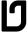
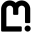
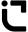
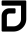
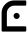
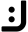
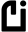
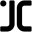
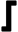
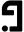
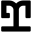
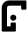
