# Kromagg Alphabet (Sliders)

> Source: [https://www.dcode.fr/kromagg-alphabet-sliders](https://www.dcode.fr/kromagg-alphabet-sliders)
> Retrieved: 2026-08-08
> Attribution: dCode.fr (CC BY notice on the source page).
> Reference-only extract: no converter, solver, API, or implementation code.

## What is the Kromagg alphabet? (Definition)

The Kromagg alphabet is a fictional writing system associated with the Kromaggs, an antagonistic humanoid species in the TV series Sliders (1995-2000). In the series, this alphabet appears visually but is never explained. Known representations come from set pieces or props.

## How to write in Kromagg?

Writing in Kromagg consists of using the correspondence table: A B D E F H I J L M N O P Q R S T U V X dCode.fr

A B D E F H I J L M N O P Q R S T U V X dCode.fr

Each Latin letter is replaced by a Kromagg symbol. This process allows a direct letter-by-letter transcription except for C , G , K , W , Y , and Z which are missing.

Example: SLIDERS translates to

No Kromagg numerical system is known.

## Why are the letters C, G, K, W, Y, and Z missing from the Kromagg alphabet?

No official explanation exists regarding the absence of the letters C , G , K , W , Y , and Z .

A plausible hypothesis is that the Kromagg script does not contain certain phonemes.

It is also possible that this is for aesthetic or graphic design reasons rather than linguistic ones.

## How to decode a Kromagg message?

Decoding a Kromagg message consists of applying the reverse correspondence table. The user identifies each symbol and then replaces it with the corresponding letter.

Example: translates to QUINN

## How to recognize the Kromagg alphabet?

The Kromagg alphabet is recognized by stylized, mainly curved symbols resembling small drawings or scribbles.

Any reference to the TV series Sliders is obviously a clue.

dCode uses the font created by Michael H. Lee and Josh Dixon

## Reference Images

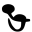
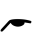
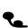
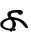
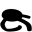
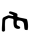
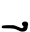
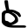
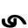
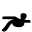
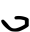
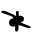
